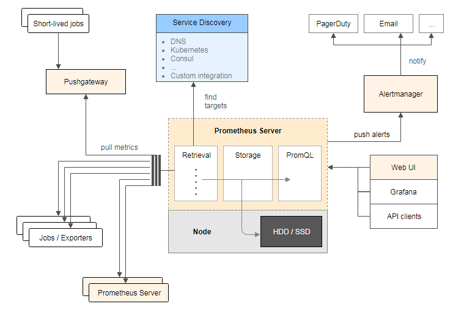

## LogTransfer

从kafka里面把日志取出来,写入ES,使用Kibana做可视化的展示

### Elasticsearch

[ES介绍博客地址](https://www.liwenzhou.com/posts/Go/go_elasticsearch/)

[ES搭建指南](https://docs.qq.com/doc/DTmZxQUdHeFRXU2dP)

### Kibana

详见[ES搭建指南](https://docs.qq.com/doc/DTmZxQUdHeFRXU2dP)

### kafka消费

根据topic找所有的分区

每一个分区去消费数据

```go
package main

import (
	"fmt"

	"github.com/Shopify/sarama"
)

// kafka consumer

func main() {
	consumer, err := sarama.NewConsumer([]string{"127.0.0.1:9092"}, nil)
	if err != nil {
		fmt.Printf("fail to start consumer, err:%v\n", err)
		return
	}
	partitionList, err := consumer.Partitions("web_log") // 根据topic取到所有的分区
	if err != nil {
		fmt.Printf("fail to get list of partition:err%v\n", err)
		return
	}
	fmt.Println(partitionList)
	for partition := range partitionList { // 遍历所有的分区
		// 针对每个分区创建一个对应的分区消费者
		pc, err := consumer.ConsumePartition("web_log", int32(partition), sarama.OffsetNewest)
		if err != nil {
			fmt.Printf("failed to start consumer for partition %d,err:%v\n", partition, err)
			return
		}
		defer pc.AsyncClose()
		// 异步从每个分区消费信息
		go func(sarama.PartitionConsumer) {
			for msg := range pc.Messages() {
				fmt.Printf("Partition:%d Offset:%d Key:%v Value:%v", msg.Partition, msg.Offset, msg.Key, msg.Value)
			}
		}(pc)
	}
}
```

### LogTransfer实现

### 加载配置文件

```go
// 0. 加载配置文件
var cfg = new(conf.LogTransferCfg)
err := ini.MapTo(cfg, "./conf/cfg.ini")
if err != nil {
	fmt.Printf("init config failed, err:%v\n", err)
	return
}
fmt.Printf("cfg:%v\n", cfg)
```

两个坑:

1. 在一个函数中修改变量一定要传指针
2. 在配置文件对应的结构体中一定要设置tag(特别是嵌套的结构体)


## 系统监控

gopsutil做系统监控信息的采集,写入influxDB,使用grafana作展示

prometheus监控:采集性能指标数据,保存起来,使用grafana作展示


