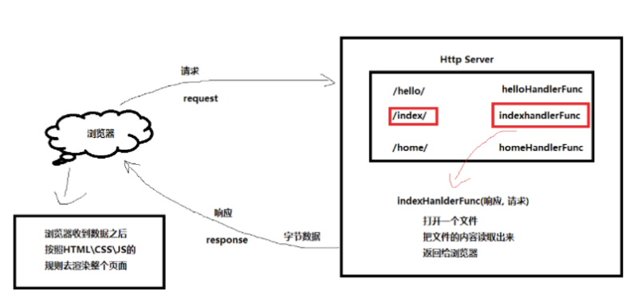
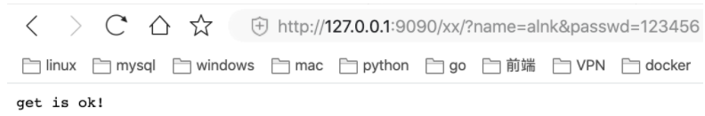
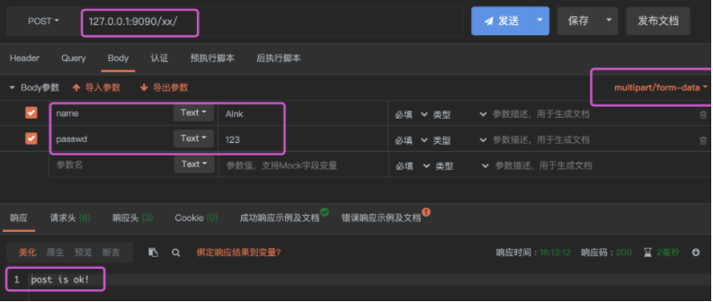

# 常用内置包

## net/http包

### http请求和响应

  


### http服务端

#### main.go文件

```go
package main

import (
	"fmt"
	"io/ioutil"
	"net/http"
)

// http server

func f1(w http.ResponseWriter, r *http.Request) {
	defer r.Body.Close() //关闭连接

	b, err := ioutil.ReadFile("./xx.html")
	if err != nil {
		w.Write([]byte(fmt.Sprintf("%v", err))) //如果找不到文件，直接把错误返回给浏览器
	}

	w.Write(b)
}

func f2(w http.ResponseWriter, r *http.Request) {
	defer r.Body.Close() //关闭连接

	// 获取请求的方式
	fmt.Println(r.Method) //GET POST等等

	// 请求头
	fmt.Println("Header: ", r.Header)
	//自己写的客户端访问的请求头
	//Header:  map[Accept-Encoding:[gzip] Content-Length:[33] Content-Type:[application/json] User-Agent:[Go-http-client/1.1]]
	//用浏览器访问的请求头
	//Header:  map[
	// Accept:[text/html,application/xhtml+xml,application/xml;q=0.9,image/webp,image/apng,*/*;q=0.8]
	// Accept-Encoding:[gzip, deflate, br]
	// Accept-Language:[zh-CN,zh;q=0.9]
	// Connection:[keep-alive]
	// Cookie:[csrftoken=2tO2t7lIF0yq5bQhg7VQRORGmejfFtQhoJv4kSbzrDiExqLSuE5i198y31BzZAnp]
	// Upgrade-Insecure-Requests:[1]
	// User-Agent:[Mozilla/5.0 (Macintosh; Intel Mac OS X 10_15_4)
	// AppleWebKit/537.36 (KHTML, like Gecko) Chrome/69.0.3497.100 Safari/537.36]]

	//GET请求
	if r.Method == "GET" {
		//Get请求，所有的参数都是放在URL上的，请求体中是没有数据的
		//发送请求的url http://127.0.0.1:9090/xx/?name=alnk&passwd=123456
		url := r.URL
		fmt.Println("url: ", url) //url:  /xx/?name=alnk&passwd=123456

		//获取请求中的参数
		//如果请求中一个参数有多个值怎么处理？
		queryParam := r.URL.Query()
		name := queryParam.Get("name")
		passwd := queryParam.Get("passwd")
		fmt.Printf("name:%s passwd:%s\n", name, passwd) //name:alnk passwd:123456

		//返回数据给客户端
		w.Write([]byte("get is ok!\n"))
	}

	//POST请求 这里也可以使用postman发送请求数据
	if r.Method == "POST" {
		//获取客户端传过来的表单数据，
		//注意如果打开获取表单数据，那么就把获取json数据注释掉，不然可能会出问题
		fmt.Printf("name:%s, %T\n", r.FormValue("name"), r.FormValue("name"))
		fmt.Printf("name:%s, %T\n", r.FormValue("passwd"), r.FormValue("passwd"))

		//获取客户端传过来的json数据
		//b, err := ioutil.ReadAll(r.Body)
		//if err != nil {
		//	fmt.Println("读取数据报错了哦", err)
		//	return
		//}
		//bToString := string(b) //可以通过内置的json包转换成对应的结构体
		//fmt.Printf("%T -- %v\n", bToString, bToString)

		//返回数据给客户端
		w.Write([]byte("post is ok!"))
	}
}

func main() {
	http.HandleFunc("/hello/", f1)
	http.HandleFunc("/xx/", f2)
	http.ListenAndServe("0.0.0.0:9090", nil)
}
```


#### 浏览器发送GET请求

  


#### GET

  


#### 工具发送POST请求

  


### http模拟浏览器客户端

#### GET访问

##### 1.参数直接写在Get方法中的URL里

```go
package main

import (
	"fmt"
	"io/ioutil"
	"net/http"
)

/*
客户端

[长连接和短连接]
https://www.zhihu.com/question/22677800
*/

func main() {
	//一.GET访问服务端
	// 1.参数直接写在Get方法中的URL里
	resp, err := http.Get("http://127.0.0.1:9090/xx/?name=alnk&passwd=123456")
	if err != nil {
		fmt.Printf("get url failed, err:%v\n", err)
		return
	}
	defer resp.Body.Close() //一定要记得关闭resp.Body

	// 获取服务端的返回
	receByte, err := ioutil.ReadAll(resp.Body)
	if err != nil {
		fmt.Printf("read from resp.Body failed, err:%v\n", err)
		return
	}
	fmt.Println(string(receByte)) // get is ok!
}
```

##### 2.拼接参数发送Get请求

```go
package main

import (
	"fmt"
	"io/ioutil"
	"net/http"
)

/*
客户端

[长连接和短连接]
https://www.zhihu.com/question/22677800
*/

func main() {
  // 2.拼接参数发送Get请求 这个例子相比于上一个例子是更加灵活的，比如可以自定义请求头等
	apiUrl := "http://127.0.0.1:9090/xx/" //URL
	// URL参数
	data := url.Values{} //可以看源码
	data.Set("name", "alnk")
	data.Set("passwd", "123")

	u, err := url.ParseRequestURI(apiUrl)
	if err != nil {
		fmt.Printf("parse url requestUrl failed, err:%v\n", err)
		return
	}
	u.RawQuery = data.Encode() //url编码

	// 发送请求给服务端
	resp, err := http.Get(u.String())
	fmt.Printf("u.String(): %s\n", u.String()) //u.String():  http://127.0.0.1:9090/xx/?name=alnk&passwd=123
	if err != nil {
		fmt.Printf("get failed , err:%v\n", err)
		return
	}
	defer resp.Body.Close() //关闭连接

	// 获取服务端返回值
	b, err := ioutil.ReadAll(resp.Body)
	if err != nil {
		fmt.Println("get resp failed ", err)
	}
	fmt.Println(string(b)) //get is ok!
}
```


#### POST访问

##### 1.表单数据访问服务端

```go
package main

import (
	"fmt"
	"io/ioutil"
	"net/http"
)

// 客户端

func main() {
  // POST访问服务端
	url := "http://127.0.0.1:9090/xx/"
	// 表单数据
	contentType := "application/x-www-form-urlencoded"
	data := "name=alnk&passwd=123456"

	// 发送post请求
	resp, err := http.Post(url, contentType, strings.NewReader(data))
	if err != nil {
		fmt.Printf("post failed, err:%v\n", err)
		return
	}
	defer resp.Body.Close() //一定要关闭连接

	// 获取服务端返回数据
	b, err := ioutil.ReadAll(resp.Body)
	if err != nil {
		fmt.Println("get resp failed, ", err)
		return
	}
	fmt.Println(string(b)) //post is ok!
}
```

##### 2.json数据访问服务端

```go
package main

import (
	"fmt"
	"io/ioutil"
	"net/http"
)

// 客户端

func main() {
  // POST访问服务端
	url := "http://127.0.0.1:9090/xx/"
	
  // json数据
	contentType := "application/json"
	data := `{"name":"alnk","passwd":"123456"}`

	// 发送post请求
	resp, err := http.Post(url, contentType, strings.NewReader(data))
	if err != nil {
		fmt.Printf("post failed, err:%v\n", err)
		return
	}
	defer resp.Body.Close() //一定要关闭连接

	// 获取服务端返回数据
	b, err := ioutil.ReadAll(resp.Body)
	if err != nil {
		fmt.Println("get resp failed, ", err)
		return
	}
	fmt.Println(string(b)) //post is ok!
}
```


## os.Args包

```go
package main

import (
	"fmt"
	"os"
)

// os.Args
// 简单的获取命令行参数，使用os.Args来获取
// os.Args是一个[]string
// os.Args是一个存储命令行参数的字符串切片，它的第一个元素是执行文件的名称本身

func main() {
	for index, arg := range os.Args {
		fmt.Printf("args[%d]=%v\n", index, arg)
	}
}
```

```shell
# 执行结果
# 需要编译以后执行
lichengguo@lichengguodeMacBook-Pro 02os.Args_demo % go build
lichengguo@lichengguodeMacBook-Pro 02os.Args_demo % ./02os.Args_demo args1 args2
args[0]=./02os.Args_demo
args[1]=args1
args[2]=args2
```


## flag包

```go
package main

import (
	"flag"
	"fmt"
	"time"
)

/*
flag包实现了命令行参数的解析
flag包支持的命令行参数类型有bool、int、int64、uint、uint64、float float64、string、duration(时间)

字符串flag				合法字符串
整数flag				1234、0664、0x1234等类型，也可以是负数。
浮点数flag				合法浮点数
bool类型flag			1, 0, t, f, T, F, true, false, TRUE, FALSE, True, False。
时间段flag				任何合法的时间段字符串。如”300ms”、”-1.5h”、”2h45m”。
						合法的单位有”ns”、”us” /“µs”、”ms”、”s”、”m”、”h”。
*/

func f1() {
	// 定义命令行参数方式
	var name string
	var age int
	var married bool
	var delay time.Duration

	flag.StringVar(&name, "name", "张三", "姓名") //变量指针，参数名称，默认值，help提示语
	flag.IntVar(&age, "age", 0, "年龄")
	flag.BoolVar(&married, "married", false, "婚否")
	flag.DurationVar(&delay, "delay", 0, "结婚多少时间了")

	// 解析命令行参数
	flag.Parse()

	//
	fmt.Println(name, age, married, delay)

	// 返回命令行参数后的其他参数
	fmt.Println(flag.Args()) //[]string 类型

	// 返回命令行参数后的其他参数个数
	fmt.Println(flag.NArg())

	// 返回使用的命令行参数的个数
	fmt.Println(flag.NFlag())
}

func main() {
	f1()
}

/*
使用方法
提示
% ./03flag_demo -help
Usage of ./02flag_demo:
  -age int
        年龄 (default 18)
  -delay duration
        延迟时间间隔
  -married
        婚否
  -name string
        姓名 (default "张三")

默认值
% ./03flag_demo
张三 18 false 0s
[]
0
0

正常使用命令行参数
./02flag_demo -name 沙河娜扎 --age 28 -married=false -delay=1h30m
沙河娜扎 28 false 1h30m0s
[]
0
4

% ./02flag_demo -name 沙河娜扎 --age 28 -married=false -delay=1h30m a b c
沙河娜扎 28 false 1h30m0s
[a b c]  flag.Args()
3 		 flag.NArg()
4		 flag.NFlag()
*/
```
