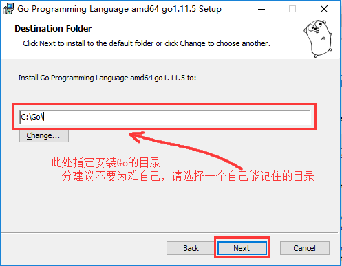

### 安装Go开发包

> 下载链接
>
> [https://golang.google.cn/dl/](https://golang.google.cn/dl/)
>
>   
>
> 安装目录一定选一个好记的
>
>   
>
> 安装完成后，输入 `go version`查看go版本号
>
>   


### 配置GOPATH

>   
>
>   
>
> ```text
> 详细步骤：
> 1. 在电脑上新建一个目录D:\go（存放编写的Go语言代码）
> 2. 在环境变量里，新建一项：GOPATH:D:\go
> 3. 在D:\go下新建三个文件夹，分别是：bin、src、pkg
> 4. 把D:\go\bin这个目录添加到PATH这个环境变量的后面
>    Win7是英文的;分隔
>    Win10是单独一行
> 5. 电脑上GOPATH是有默认值的，通常是%USERPROFILE%/go，把这一项删掉，按照上面的步骤新建一个就可以了
> ```
>
>   


### VS Code

#### 下载VSCODE

> 官方下载连接
>
> https://code.visualstudio.com/Download

#### 安装

> 直接下一步就行

#### vscode进行go相关的基础设置

> ```
> ctrl+b 打开左侧边栏
> 文件 --- 将文件夹添加到工作区... --- 可以同时打开多个不同的项目，对比查看代码很方便
> 
> ctrl+shift+x   打开扩展栏，搜索go插件并安装
> ctrl+shift+p   选择 Go:Install/Update Tools，选择列出的工具并确认安装
> 
> 由于是从github下载，国内网络大概率会失败，这个时候在vscode打开一个终端，运行：
> 设置代理 go env -w GOPROXY=https://goproxy.cn
> 清空缓存 go clean --modcache
> 
> 其他推荐的插件
> vscode中文插件   Chinese
> 代码快捷运行插件  Code Runner
> ```

#### 安装中文插件包

>   

#### 安装Go扩展

>   


### 编译

#### go build 编译

> ```
> 使用go build
> 1. 在项目目录下执行go build
> 3. go build -o hello.exe
> ```

#### go run 运行

> ```
> 像执行脚本文件一样执行Go代码
> go run main.go
> ```

#### go install 编译安装

> ```
> go install分为两步
> 1. 先编译得到一个可执行文件
> 2. 将可执行文件拷贝到GOPATH/bin
> ```

#### 交叉编译

> ```
> Go支持跨平台编译
> 
> windows平台编译一个能在linux平台执行的可执行文件
> SET CGO_ENABLED=0  // 禁用CGO
> SET GOOS=linux     // 目标平台是linux
> SET GOARCH=amd64   // 目标处理器架构是amd64
> 执行go build
> 
> Mac平台交叉编译
> CGO_ENABLED=0 GOOS=linux GOARCH=amd64 go build
> CGO_ENABLED=0 GOOS=windows GOARCH=amd64 go build
> ```

