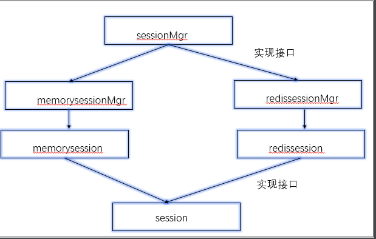

## 接口

### 接口的定义和实现

```go
package main

import "fmt"

/*
[接口]
接口（interface）定义了一个对象的行为规范，只定义规范不实现，由具体的对象来实现规范的细节

在Go语言中接口（interface）是一种类型，一种抽象的类型，interface是一组method(方法)的集合

接口做的事情就像是定义一个协议（规则），只要一台机器有洗衣服和甩干的功能，我就称它为洗衣机。不关心属性（数据），只关心行为（方法）。
为了保护你的Go语言职业生涯，请牢记接口（interface）是一种类型

[为什么要使用接口？]
type Cat struct{}
func (c Cat) Say() string { return "喵喵喵" }

type Dog struct{}
func (d Dog) Say() string { return "汪汪汪" }

func main() {
	c := Cat{}
	fmt.Println("猫:", c.Say())
	d := Dog{}
	fmt.Println("狗:", d.Say())
}
上面的代码中定义了猫和狗，然后它们都会叫，你会发现 main 函数中明显有重复的代码，
如果我们后续再加上猪、青蛙等动物的话，我们的代码还会一直重复下去。
那我们能不能把它们当成“能叫的动物”来处理呢？
Go语言中为了解决类似上面的问题，就设计了接口这个概念。
接口区别于我们之前所有的具体类型，接口是一种抽象的类型。
当你看到一个接口类型的值时，你不知道它是什么，唯一知道的是通过它的方法能做什么。

Go语言提倡面向接口编程
每个接口由数个方法组成，接口的定义格式如下
type 接口类型名 interface{
    方法名1( 参数列表1 ) 返回值列表1
    方法名2( 参数列表2 ) 返回值列表2
    …
}
其中：
	接口名：使用type将接口定义为自定义的类型名。Go语言的接口在命名时，一般会在单词后面添加er，
           如有写操作的接口叫Writer，有字符串功能的接口叫Stringer等。
           接口名最好要能突出该接口的类型含义。
	方法名：当方法名首字母是大写且这个接口类型名首字母也是大写时，这个方法可以被接口所在的包（package）之外的代码访问。
	参数列表、返回值列表：参数列表和返回值列表中的参数变量名可以省略


[实现接口的条件]
一个对象只要 全部实现 了接口中的方法，那么就实现了这个接口。换句话说，接口就是一个需要实现的方法列表
如果接口中有没被实现的方法，那么就会报错.
结构体实现接口中的方法，要么全部实现，要么就一个别实现，否则报错

[接口类型变量]
那实现了接口有什么用呢？
接口类型变量能够存储所有实现了该接口的实例。 例如上面的示例中，Sayer类型的变量能够存储dog和cat类型的变量。
*/

// 示例
// 由于猫、狗、人都能叫
// 所以定义一个能叫的接口
type speaker interface {
	speak() //只要实现了speak方法的变量都是speaker类型, 方法签名
}

//定义结构体
type cat struct{}

type dog struct{}

type person struct{}

// 定义相对应的方法，实现接口
func (c cat) speak() {
	fmt.Println("喵喵喵~")
}

func (d dog) speak() {
	fmt.Println("旺旺旺~")
}

func (p person) speak() {
	fmt.Println("啊啊啊~")
}

// 定义一个函数
func da(x speaker) {
	// 接收一个参数,传进来什么,我就打什么
	x.speak() // 挨打了就要叫
}

func main() {
	var c1 cat
	var d1 dog
	var p1 person

	da(c1)
	da(d1)
	da(p1)

	var ss speaker // 定义一个接口类型:speaker 的变量:ss
	ss = c1
	fmt.Printf("%T\n", ss) //main.cat
	ss = d1
	fmt.Printf("%T\n", ss) //main.dog
	ss = p1
	fmt.Printf("%T\n", ss) //main.person
}
```

```go
package main

import "fmt"

// 定义支付接口
type payer interface {
	pay()
}

// 定义支付函数
func pay(p payer) {
	p.pay()
}

// 定义结构体
type weixin struct {
	name string
}

// 定义结构体方法 实现接口中的方法
func (w weixin) pay() {
	fmt.Printf("尊敬的[%s],欢迎使用微信支付~\n", w.name)
}

// 定义结构体
type alipay struct {
	name string
}

// 定义结构体方法 实现接口中的方法
func (a alipay) pay() {
	fmt.Printf("欢迎[%s]使用阿里支付~\n", a.name)
}

func main() {
	var w weixin
	var a alipay
	w.name = "Alnk"
	a.name = "tom"
	pay(w)
	pay(a)

	////实现接口以后就不用每次都这么写重复的代码了
	//p1 := weixin{"Alnk"}
	//p1.pay()
	//p2 := alipay{"tom"}
	//p2.pay()
}
```

```go
package main

import "fmt"

// 接口示例2
// 不管什么牌子的车都能跑

// 定义一个car接口类型
// 不管是什么结构体，只要有run方法都能是carer类型
type carer interface {
	run() //只要实现了run方法的变量都是carer类型, 方法签名
}

//drive 定义一个函数
func drive(c carer) {
	c.run()
}

// falali 定义一个结构体
type falali struct {
	name string
}

// falali 的run方法
func (f falali) run() {
	fmt.Printf("%s的速度70\n", f.name)
}

// baoshijie 定义一个结构体
type baoshijie struct {
	name string
}

// baoshijie 的run方法
func (b baoshijie) run() {
	fmt.Printf("%s的速度100\n", b.name)
}

func main() {
	f := falali{"法拉利"}
	//f.run()
	drive(f)

	b := baoshijie{"保时捷"}
	drive(b)
}
```

```go
package main

import "fmt"

// 接口的实现

// 定义一个动物接口
type animal interface {
	move()
	eat(string)
}

// 定义一个猫的结构体
type cat struct {
	name string
	feet int8
}

// 猫结构体方法
func (c cat) move() {
	fmt.Println("走猫步...")
}

// 猫结构体方法
func (c cat) eat(food string) {
	fmt.Printf("猫吃%s...\n", food)
}

// 定义一个鸡的结构体
type chicken struct {
	feet int8
}

// 鸡结构体方法
func (c chicken) move() {
	fmt.Println("鸡动!")
}

// 鸡结构体方法
func (c chicken) eat(food string) {
	fmt.Printf("吃%s...\n", food)
}

func main() {
	var a1 animal          //定义一个接口类型的变量
	fmt.Printf("%T\n", a1) //<nil>

	// 定义一个cat类型的变量bc
	bc := cat{
		name: "淘气",
		feet: 4,
	}
	a1 = bc
	a1.eat("小黄鱼")          //猫吃小黄鱼...
	fmt.Printf("%T\n", a1) //main.cat
	fmt.Println(a1)        //{淘气 4}
	fmt.Println(bc)        //{淘气 4}

	kfc := chicken{feet: 2}
	a1 = kfc
	fmt.Printf("%T\n", a1) //main.chicken
	a1.eat("饲料")           //吃饲料...
}
```


### 值接收者和指针接收者的区别

```go
package main

import "fmt"

// 使用值接收者和指针接收者的区别？
// 使用值接收者实现接口,结构体类型和结构体指针类型的变量都能存
// 使用指针接收者实现接口,只能存结构体指针类型的变量

// Mover接口和一个dog结构体
type Mover interface {
	move()
}

type dog struct{}

//// 值接收者实现接口
//func (d dog) move() {
//	fmt.Println("狗会动")
//}
//// 实现接口的是dog类型
//func main() {
//	var x Mover
//	var wangcai = dog{} // 旺财是dog类型
//	x = wangcai         // x可以接收dog类型
//	x.move()
//	var fugui = &dog{} // 富贵是*dog类型
//	x = fugui          // x可以接收*dog类型
//	x.move()
//}
//
///*
//从上面的代码中我们可以发现，使用值接收者实现接口之后，
//不管是 dog结构体 还是 结构体指针*dog类型 的变量都可以赋值给该接口变量。
//因为Go语言中有对指针类型变量求值的语法糖，
//dog指针fugui内部会自动求值*fugui
//*/

// 指针接收者实现接口
func (d *dog) move() {
	fmt.Println("狗会动")
}

func main() {
	var x Mover
	//var wangcai = dog{} // 旺财是dog类型
	//x = wangcai         // x不可以接收dog类型
	var fugui = &dog{} // 富贵是*dog类型
	x = fugui          // x可以接收*dog类型
	x.move()
}

// 此时实现Mover接口的是*dog类型，所以不能给x传入dog类型的wangcai，此时x只能存储*dog类型的值fugui
```

```go
package main

import "fmt"

// 注意：这是一道你需要回答“能”或者“不能”的题！
// 首先请观察下面的这段代码，然后请回答这段代码能不能通过编译？

type People interface {
	Speak(string) string
}

type Student struct{}

func (stu *Student) Speak(think string) (talk string) {
	if think == "sb" {
		talk = "你是个大帅比"
	} else {
		talk = "您好"
	}
	return
}

func main() {
	var peo People
	peo = Student{}
	//peo = &Student{} //注意这里要返回指针类型才行，因为方法中接收的是指针类型

	think := "bitch"
	fmt.Println(peo.Speak(think))
}
```


### 接口和类型的关系

```go
package main

import "fmt"

// 一个类型可以实现多个接口
// 同一个结构体可以实现多个接口
// 接口还可以嵌套

// 接口
type animal interface {
	mover
	eater
}

// 接口
type mover interface {
	move()
}

// 接口
type eater interface {
	eat(string)
}

// cat结构体
type cat struct {
	name string
	feet int8
}

// cat实现了mover接口
func (c *cat) move() {
	fmt.Println("走猫步...")
}

// cat实现了eater接口
func (c *cat) eat(food string) {
	fmt.Printf("猫吃%s...\n", food)
}

func main() {
	c1 := cat{
		name: "tom",
		feet: 4,
	}

	var a1 animal

	a1 = &c1
	a1.move()     // 走猫步...
	a1.eat("小黄鱼") // 猫吃小黄鱼...

	var m1 mover
	m1 = &c1
	m1.move() // 走猫步...

	var e1 eater
	e1 = &c1
	e1.eat("鱼仔") // 猫吃鱼仔...
}
```


### 空接口

```go
package main

import "fmt"

// 空接口
// 空接口是指没有定义任何方法的接口
// 因此任何类型都实现了空接口
// 空接口类型的变量可以存储任意类型的变量

// interface:关键字
// interface{}:空接口类型

// 空接口的应用:
// 1.空接口作为函数的参数
// 2.空接口作为map的值

// 空接口作为函数参数
func show(a interface{}) {
	fmt.Printf("type:%T --- value:%v\n", a, a)
}

func main() {
	// 空接口作为map的值
	var m1 map[string]interface{}
	m1 = make(map[string]interface{}, 16)
	m1["name"] = "周林"
	m1["age"] = 9000
	m1["merried"] = true
	m1["hobby"] = [...]string{"唱", "跳", "rap"}
	fmt.Printf("%#v\n", m1) //map[string]interface {}{"age":9000, "hobby":[3]string{"唱", "跳", "rap"}, "merried":true, "name":"周林"}

	// 空接口作为函数参数
	show(false) //type:bool --- value:false
	show(nil)   //type:<nil> --- value:<nil>
	show(m1)    //type:map[string]interface {} --- value:map[age:9000 hobby:[唱 跳 rap] merried:true name:周林]

	// 空接口作为map的键和值
	var m2 map[interface{}]interface{}
	m2 = make(map[interface{}]interface{}, 5)
	m2[1] = "a"
	m2["b"] = true
	m2[true] = 1
	fmt.Printf("%#v\n", m2) //map[interface {}]interface {}{true:1, 1:"a", "b":true}
	show(m2)                //type:map[interface {}]interface {} --- value:map[true:1 1:a b:true]
}
```


### 类型断言

```go
package main

import "fmt"

/*
[类型断言]
空接口可以存储任意类型的值，那我们如何获取其存储的具体数据呢

一个接口的值（简称接口值）是由一个 具体类型 和 具体类型的值 两部分组成的
这两部分分别称为 接口的动态类型 和 接口的动态值

想要判断空接口中的值这个时候就可以使用类型断言，其语法格式：
x.(T)
其中：
	x：表示类型为interface{}的变量
	T：表示断言x可能是的类型
该语法返回两个参数，第一个参数是x转化为T类型后的变量，第二个值是一个布尔值，若为true则表示断言成功，为false则表示断言失败

因为空接口可以存储任意类型值的特点，所以空接口在Go语言中的使用十分广泛

重点：关于接口需要注意的是，只有当 [有两个或两个以上的具体类型] 必须以相同的方式进行处理时才需要定义接口。
不要为了接口而写接口，那样只会增加不必要的抽象，导致不必要的运行时损耗
*/

// 类型断言1
func assign(a interface{}) {
	fmt.Printf("%T\n", a)
	str, ok := a.(string)
	if !ok {
		fmt.Println("猜错了")
	} else {
		fmt.Println("传进来的是一个字符串: ", str)
	}
}

// 类型断言2
// x.(type)
// x表示类型为interface{}的变量
// type获取x变量的动态类型
func assign2(a interface{}) {
	fmt.Printf("%T\n", a)
	switch t := a.(type) {
	case string:
		fmt.Println("这是一个字符串:", t)
	case int:
		fmt.Println("这是一个int:", t)
	case int64:
		fmt.Println("这是一个int64:", t)
	case bool:
		fmt.Println("这是一个bool:", t)
	case []int:
		fmt.Println("这是一个slice:", t)
	case map[string]int:
		fmt.Println("是一个map[string]int:", t)
	case func():
		fmt.Println("这是一个函数类型:", t)
	}
}

func main() {
	//assign("100")
	assign2(true)
	assign2("啊哈哈")
	assign2(int64(200))
	assign2([]int{1, 2, 3})
	assign2(map[string]int{"a": 1})
}
```


### 接口练习

session中间件开发练习


目录结构

```go
02session中间件开发
├── main.go //测试session中间件
└── session
    ├── docs
    │   ├── README
    │   └── 架构图.png
    ├── memory.go
    ├── memory_session_mgr.go
    ├── session.go
    └── session_mgr.go
```


README

```go
设计一个通用的Session服务，支持内存存储和redis存储

session模块设计
    本质上k-v系统，通过key进行增删改查
    session可以存储在内存或者redis（2个版本）

    每一个用户 ---> 一个session ---> 多个key-value
    session ---> sessionMgr （多个session对应一个sessionMrg  多对一）


接口设计
Session接口设计：
    Set()
    Get()
    Del()
    Save()：session存储，redis的实现延迟加载

SessionMgr接口设计：
    Init()：初始化，加载redis地址
    CreateSeesion()：创建一个新的session
    GetSession()：通过sessionId获取对应的session对象

MemorySeesion设计：
    定义MemorySeesion对象（字段：sessionId、存kv的map，读写锁）
    构造函数，为了获取对象
    Set()
    Get()
    Del()
    Save()

MemorySeesionMgr设计：
    定义MemorySeesionMgr对象（字段：存放所有session的map，读写锁）
    构造函数
    Init()
    CreateSeesion()
    GetSession()


RedisSession设计：
    定义RedisSeesion对象（字段：sessionId，存kv的map，读写锁，redis连接池，记录内存中map是否被修改的标记）
    构造函数
    Set()：将session存到内存中的map
    Get()：取数据，实现延迟加载
    Del()
    Save()：将session存到redis


RedisSessionMgr设计：
    定义RedisSessionMgr对象（字段：redis地址、redis密码、连接池、读写锁，大map）
    构造函数
    Init()
    CreateSeesion()
    GetSession()

调用示例
如果要在多个函数中使用，设置一个全局的 session.NewMemorySessionMgr() 变量
// 设置session
memSess := session.NewMemorySessionMgr()
s1, id1, err := memSess.CreateSession() // 创建一条session
if err != nil {
    panic(err)
}
s1.Set("name", "alnk")   // 在一条session中设置值
s1.Set("isLogin", false) // 在一条session中设置值
s1.Set("isVip", false)   // 在一条session中设置值

// 获取一条session
ms1, _ := memSess.GetSession(id1) // 获取单个session
// 获取单个session里面的key-value
name1, err := ms1.Get("name")
login1, err := ms1.Get("isLogin")
vip1, err := ms1.Get("isVip")
fmt.Println(name1, login1, vip1)

### redisSession功能未完成
```


架构图.png
 


session.go

```go
package session

// 只定义session接口规范
// 其他的模块只要实现这些规范即可

type Session interface {
	Set(key string, value interface{}) error
	Get(key string) (interface{}, error)
	Del(key string) error
	Save() error
}

```


session_mgr.go

```go
package session

// 定义接口规范

// SessionMgr 定义管理者，管理所有的session
type SessionMgr interface {
	// 初始化
	Init(addr string, options ...string) (err error)
	CreateSession() (session Session, sessionId string, err error)
	GetSession(sessionId string) (session Session, err error)
}

```


memory.go

```go
package session

import (
	"errors"
	"sync"
)

// 实现Session接口

type MemorySession struct {
	sessionId string
	// 存key-value
	data   map[string]interface{}
	rwlock sync.RWMutex // 读写锁，不然如果数据量太大，map读写会出问题
}

// 构造函数
func NewMemorySession(id string) *MemorySession {
	s := &MemorySession{
		sessionId: id,
		data:      make(map[string]interface{}, 16),
	}
	return s
}

func (m *MemorySession) Set(key string, value interface{}) (err error) {
	// 加锁
	m.rwlock.Lock()
	defer m.rwlock.Unlock()
	// 设置值
	m.data[key] = value
	return
}

func (m *MemorySession) Get(key string) (value interface{}, err error) {
	m.rwlock.Lock()
	defer m.rwlock.Unlock()
	value, ok := m.data[key]
	if !ok {
		err = errors.New("key not exists in session")
		return
	}
	return
}

func (m *MemorySession) Del(key string) (err error) {
	m.rwlock.Lock()
	defer m.rwlock.Unlock()
	delete(m.data, key)
	return
}

func (m *MemorySession) Save() (err error) {
	return
}

```


memory_session_mgr.go

```go
package session

import (
	"errors"
	"github.com/satori/go.uuid"
	"sync"
)

// 实现 SessionMgr 接口

// MemorySessionMgr设计：
// 定义MemorySessionMgr对象（字段：存放所有session的map，读写锁）
// 构造函数
// Init()
// CreateSession()
// GetSession()

// 定义对象
type MemorySessionMgr struct {
	sessionMap map[string]Session
	rwlock     sync.RWMutex
}

// 构造函数
func NewMemorySessionMgr() SessionMgr {
	sr := &MemorySessionMgr{
		sessionMap: make(map[string]Session, 1024),
	}
	return sr
}

func (s *MemorySessionMgr) Init(addr string, option ...string) (err error) {
	return
}

// 创建一条session
func (s *MemorySessionMgr) CreateSession() (session Session, sessionId string, err error) {
	s.rwlock.Lock()
	defer s.rwlock.Unlock()
	// go get github.com/satori/go.uuid
	// 用uuid作为 sessionId
	id := uuid.NewV4()
	// 转 string
	sessionId = id.String()
	// 创建单个session
	session = NewMemorySession(sessionId)
	// 加入到大map
	s.sessionMap[sessionId] = session
	return
}

// 获取一条session
func (s *MemorySessionMgr) GetSession(sessionId string) (session Session, err error) {
	s.rwlock.Lock()
	defer s.rwlock.Unlock()
	session, ok := s.sessionMap[sessionId]
	if !ok {
		err = errors.New("session not exists")
		return
	}
	return
}

```


main.go

```go
package main

import (
	"02session中间件开发/session"
	"fmt"
)

var memSess = session.NewMemorySessionMgr() // 设置为全局变量，好让所以的函数都能调用

func main() {
	s, id, err := memSess.CreateSession() // 创建一条session
	if err != nil {
		panic(err)
	}
	fmt.Println("id:", id)

	// 在session中设置值
	name := "tom"
	isLogin := true
	isVip := true
	s.Set("name", name)       // 在一条session中设置值
	s.Set("isLogin", isLogin) // 在一条session中设置值
	s.Set("isVip", isVip)     // 在一条session中设置值

	// 获取一条session
	rs, err := memSess.GetSession(id)
	fmt.Printf("rs:%#v\n", rs)
	fmt.Println(rs)
}

```
