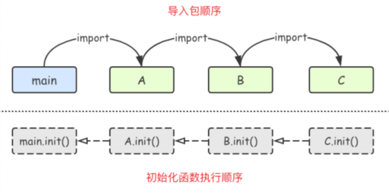
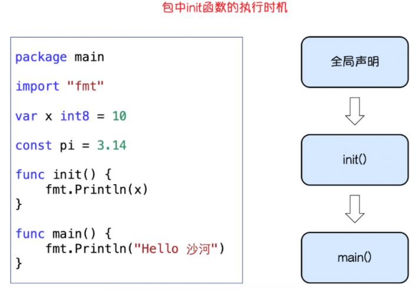

## 包

### 自定义包

```go
package _0calc

import (
	"fmt"
)

/*
[Go语言的包]
在工程化的Go语言开发项目中，Go语言的源码复用是建立在包（package）基础之上的
本文介绍了Go语言中如何定义包、如何导出包的内容及如何导入其他包

[包介绍]
包（package）是多个Go源码的集合，是一种高级的代码复用方案，Go语言为我们提供了很多内置包 如fmt、os、io等

[定义包]
我们还可以根据自己的需要创建自己的包，一个包可以简单理解为一个存放 .go 文件的文件夹
该文件夹下面的所有go文件都要在代码的第一行添加如下代码，声明该文件归属的包
package 包名
注意事项：
	一个文件夹下面直接包含的文件只能归属一个package，同样一个package的文件不能在多个文件夹下
	包名可以不和文件夹的名字一样，包名不能包含 - 符号
	包名为main的包为应用程序的入口包，这种包编译后会得到一个可执行文件，而编译不包含main包的源代码则不会得到可执行文件

[可见性]
如果想在一个包中引用另外一个包里的标识符（如变量、常量、类型、函数等）时，该标识符必须是对外可见的（public）
在Go语言中只需要将标识符的首字母大写就可以让标识符对外可见了

[包的导入]
要在代码中引用其他包的内容，需要使用import关键字导入使用的包。具体语法如下:
	import "包的路径"
注意事项：
	import导入语句通常放在文件开头包声明语句的下面
	导入的包名需要使用双引号包裹起来
	包名是从$GOPATH/src/后开始计算的，使用/进行路径分隔
	Go语言中禁止循环导入包
单行导入
	import "包1"
	import "包2"
多行导入
	import (
    "包1"
    "包2"
	)

[自定义包名]
在导入包名的时候，我们还可以为导入的包设置别名。通常用于导入的包名太长或者导入的包名冲突的情况。具体语法格式如下：
import 别名 "包的路径"
import "fmt"
import m "github.com/Q1mi/studygo/pkg_test"
func main() {
	fmt.Println(m.Add(100, 200))
	fmt.Println(m.Mode)
}

[匿名导入包]
如果只希望导入包，而不使用包内部的数据时，可以使用匿名导入包。具体的格式如下：
import _ "包的路径"
匿名导入的包与其他方式导入的包一样都会被编译到可执行文件中。

[init()初始化函数]
在Go语言程序执行时导入包语句会自动触发包内部init()函数的调用
需要注意的是：
	init()函数没有参数也没有返回值。
	init()函数在程序运行时自动被调用执行，不能在代码中主动调用它

init()函数执行顺序
Go语言包会从main包开始检查其导入的所有包，每个包中又可能导入了其他的包。
Go编译器由此构建出一个树状的包引用关系，再根据引用顺序决定编译顺序，依次编译这些包的代码
在运行时，被最后导入的包会最先初始化并调用其init()函数，如图导入包init执行顺序.png
*/

// init函数
func init() {
	fmt.Println("被导入的时候，我是自动执行的...")
}

// 包中的标识符(变量名\函数名\结构体\接口等)如果首字母是小写的，表示私有的（只能在当前这个包使用）
// 首字母大写的标识符可以被外部的包调用
func Add(x, y int) int {
	return x + y
}
```

  


自定义包的案例

目录结构

```go
├── 10calc
│   └── calc.go
├── 11import_demo
│   ├── main.go
```

calc.go文件

```go
package _0calc

import (
	"fmt"
)

// init函数
func init() {
	fmt.Println("被导入的时候，我是自动执行的...")
}

func Add(x, y int) int {
	return x + y
}
```

main.go文件

```go
package main

import (
	zhoulin "gostudy/day05/10calc"
	"fmt"
)

var x = 100

const pi = 3.14

func init() {
	fmt.Println("自动执行！")
	fmt.Println(x, pi)
}

func main() {
	ret := zhoulin.Add(10, 20)
	fmt.Println(ret)
}
```

执行过程和结果

```go
// 先编译包，也可以直接执行main.go文件(go run main.go)
go build

// 在执行被编译的文件
./11import_demo

// 执行结果
被导入的时候，我是自动执行的...
自动执行！
100 3.14
30
```


包中init函数执行的时机

  


### fmt包

```go
package main

import "fmt"

/*
fmt包主要分为 向外输出内容 和 获取输入内容 两大部分
向外输出内容：
	终端输出：Print系列 Print、Printf、Println
	文件输出：Fprint系列 Fprint、Fprintf、Fprintln函数会将内容输出到一个io.Writer接口类型的变量中，
	我们通常用这个函数往文件中写入内容

	Sprint系列函数会把传入的数据生成并返回一个字符串，拼接字符串
	Errorf函数根据format参数生成格式化字符串并返回一个包含该字符串的错误

获取输入内容
	Go语言fmt包下有fmt.Scan、fmt.Scanf、fmt.Scanln三个函数，可以在程序运行过程中从标准输入获取用户的输入
	fmt.Scan
		Scan从标准输入扫描文本，读取由空白符分隔的值保存到传递给本函数的参数中，换行符视为空白符。
	fmt.Scanf

	fmt.Scanln
		fmt.Scanln遇到回车就结束扫描了，这个比较常用

有时候我们想完整获取输入的内容，而输入的内容可能包含空格，这种情况下可以使用bufio包来实现
func bufioDemo() {
	reader := bufio.NewReader(os.Stdin) // 从标准输入生成读对象
	fmt.Print("请输入内容：")
	text, _ := reader.ReadString('\n') // 读到换行
	text = strings.TrimSpace(text)
	fmt.Printf("%#v\n", text)
}
*/

func main() {
	//fmt.Print("南山")
	//fmt.Print("alnk")
	//fmt.Println("------------")
	//fmt.Println("南山")
	//fmt.Println("alnk")
	//Printf("格式化字符串", 值)
	// %T :查看类型
	// %d :十进制数
	// %b ：二进制数
	// %o :八进制数
	// %x ：十六进制数
	// %c : 字符
	// %s ：字符串
	// %p： 指针
	// %v： 值
	// %f：浮点数
	// %t ：布尔值

	//var m1 = make(map[string]int, 1)
	//m1["lixiang"] = 100
	//fmt.Printf("%v\n", m1)  //map[lixiang:100]
	//fmt.Printf("%#v\n", m1) //map[string]int{"lixiang":100}

	//printBaifenbi(10)

	//fmt.Printf("%v\n", 100)
	////整数 -> 字符
	//fmt.Printf("%q\n", 65) // 'A'
	////浮点数 -> 复数
	//fmt.Printf("%b\n", 3.1415926)
	////字符串
	//fmt.Printf("%q\n", "理想有理想")
	//fmt.Printf("%7.3s\n", "abcdefghijk")

	//获取用户输入
	//var s string
	//fmt.Print("请输入内容：")
	//fmt.Scan(&s)
	//fmt.Println("用户输入的内容是：", s)

	//var (
	//	name  string
	//	age   int
	//	class string
	//)
	////fmt.Scanf("%s %d %s\n", &name, &age, &class) //获取用户输入，同一行
	////fmt.Println(name, age, class)
	////
	//fmt.Scanln(&name, &age, &class)
	//fmt.Println(name, age, class)

	//fmt.Printf("%b\n", 1024) //10000000000
}

func printBaifenbi(num int) {
	fmt.Printf("%d%%\n", num)
}

```

示例

```go
package main

import (
	"bufio"
	"fmt"
	"os"
)

// 获取用户输入时如果有空格

// Scanln 如果有空格会报错
func useScan() {
	var s string
	fmt.Print("请输入内容:")
	fmt.Scanln(&s)
	fmt.Printf("你输入的内容是:%s\n", s)
}

// useBufio 能处理有空格的输入
func useBufio() {
	var s string
	reader := bufio.NewReader(os.Stdin)
	fmt.Printf("请输入内容:")
	s, _ = reader.ReadString('\n')
	fmt.Printf("你输入的内容是:%s", s)
}

// Fprintln 往终端输入、往文件输出
func useFprintln() {
	fmt.Fprintln(os.Stdout, "这是一条日志") //往终端屏幕写

	fileObj, _ := os.OpenFile("./test.log", os.O_CREATE|os.O_APPEND|os.O_WRONLY, 0644)
	defer fileObj.Close()

	fmt.Fprintln(fileObj, "这是一条日志记录!") //往文件写
}

func main() {
	//useScan()
	//useBufio()
	useFprintln()
}
```


### 文件读写操作包

读取文件

```go
package main

import (
	"bufio"
	"fmt"
	"io"
	"io/ioutil"
	"os"
)

/*
[Go语言文件操作] -- 读取文件

文件是什么？
计算机中的文件是存储在外部介质（通常是磁盘）上的数据集合，文件分为文本文件和二进制文件

[打开和关闭文件]
os.Open()函数能够打开一个文件，返回一个*File和一个err。对得到的文件实例调用close()方法能够关闭文件

[读取文件的三种方法]
1.Read方法定义如下：
	func (f *File) Read(b []byte) (n int, err error)
    它接收一个字节切片，返回读取的字节数和可能的具体错误，读到文件末尾时会返回0和io.EOF

2.bufio读取文件

3.ioutil读取整个文件，如果文件很大，使用这种方法是否会导致内存飙升？
*/

// 1.第一种读取文件的方法 os.Open() file.Read()
func readFromFile1() {
	fileObj, err := os.Open("./main.go") //底层调用的其实就是OpenFile函数，只不过Open函数更简单
	//fileObj, err := os.OpenFile("./main.go", os.O_RDONLY, 0)
	if err != nil {
		fmt.Printf("open file failed, err:%v\n", err)
		return
	}

	// 记得关闭文件
	defer fileObj.Close()

	// 读文件
	//var tmp = make([]byte, 128) //指定读的长度 切片
	var tmp [128]byte // 数组

	for {
		n, err := fileObj.Read(tmp[:])
		if err == io.EOF {
			fmt.Println("读完了")
			return
		}
		if err != nil {
			fmt.Printf("read from file failed, err:%v\n", err)
			return
		}
		//fmt.Printf("读了%d个字节\n", n)
		fmt.Printf("%s", string(tmp[:n])) //为了保持文本输出的格式，这里建议用Printf

		if n < 128 {
			return
		}
	}
}

// 2.bufio
// bufio是在file的基础上封装了一层API，支持更多的功能
func readFromFilebyBufio() {
	// 1.打开文件
	fileObj, err := os.Open("./main.go")
	if err != nil {
		fmt.Printf("open file failed, err:%v\n", err)
		return
	}

	// 2.关闭文件
	defer fileObj.Close()

	// 3.创建一个用来从文件中读内容的对象
	reader := bufio.NewReader(fileObj)

	// 4.循环读取文件内容
	for {
		line, err := reader.ReadString('\n') //这里可能会产生bug，如果一行的结尾不是\n的话
		if err == io.EOF {
			//fmt.Println("文件读完了！！！")
			return
		}
		if err != nil {
			fmt.Printf("read line failed, err:%v\n", err)
			return
		}
		fmt.Print(line)
	}
}

// 3.ioutil读取整个文件
func readFromFileByIoutil() {
	ret, err := ioutil.ReadFile("./main.go")
	if err != nil {
		fmt.Printf("read file failed, err:%v\n", err)
		return
	}

	fmt.Println(string(ret))
}

func main() {
	//readFromFile1()
	//readFromFilebyBufio()
	readFromFileByIoutil()
}
```


写入文件

```go
package main

import (
	"bufio"
	"fmt"
	"io/ioutil"
	"os"
)

/*
[文件写入操作]
os.OpenFile()函数能够以指定模式打开文件，从而实现文件写入相关功能
func OpenFile(name string, flag int, perm FileMode) (*File, error) {}
其中：
	name：要打开的文件名
	flag：打开文件的模式
	perm：权限

模式有以下几种：
	os.O_WRONLY	只写
	os.O_CREATE	创建文件
	os.O_RDONLY	只读
	os.O_RDWR	读写
	os.O_TRUNC	清空
	os.O_APPEND	追加

Write和WriteString
	Write：写入字节切片数据
	WriteString：直接写入字符串数据
*/

// 1.os.OpenFile() 打开文件写内容
func writeDemo1() {
	// 1.打开文件
	fileObj, err := os.OpenFile("./test1.txt", os.O_WRONLY|os.O_CREATE|os.O_TRUNC, 0644) //只写，如果文件不存在则创建，如果存在则清空
	if err != nil {
		fmt.Printf("open file failed, err:%v\n", err)
		return
	}
	// 2.关闭文件
	defer fileObj.Close()

	// 3.write 方法写入
	n, err := fileObj.Write([]byte("zhoulin mengbi le 嘛!\n"))
	if err != nil {
		fmt.Printf("write file failed, err:%v\n", err)
		return
	}
	fmt.Println("n:", n) //写入了多少个字节

	// 4.writeString 方法写入
	n, err = fileObj.WriteString("周林解释不了!\n")
	if err != nil {
		fmt.Printf("write file failed, err:%v\n", err)
		return
	}
	fmt.Println("n:", n) //写入了多少个字节
}

// 2.bufio.NewWriter() 写入文件
func writeDemo2() {
	// 1.打开文件
	fileObj, err := os.OpenFile("./test2.txt", os.O_WRONLY|os.O_CREATE|os.O_APPEND, 0644) //追加写入，不存在则创建
	if err != nil {
		fmt.Printf("open file failed, err:%v\n", err)
		return
	}

	// 2.关闭文件
	defer fileObj.Close() //延迟关闭文件

	// 3.写入文件
	wr := bufio.NewWriter(fileObj) //创建一个写的对象
	wr.WriteString("hello沙河\n")    //写到缓存中 WriteString
	wr.Write([]byte("难受啊\n"))      //写到缓存中 Write
	wr.Flush()                     //将缓存中的内容写入文件
}

// 3.ioutil.WriteFile 写入文件
func writeDemo3() {
	str := "hello沙河\n"
	err := ioutil.WriteFile("./test3.txt", []byte(str), 0644) //这种写入方式会清空被写入文件之前的数据
	if err != nil {
		fmt.Printf("write file failed, err:%v\n", err)
		return
	}
}

func main() {
	writeDemo1()
	writeDemo2()
	writeDemo3()
}
```


往文件中插入内容

```go
package main

import (
	"fmt"
	"io"
	"os"
)

// 往文件中插入内容

func f2() {
	// 1.打开要操作的文件
	f, err := os.OpenFile("./test.txt", os.O_RDWR, 0644)
	if err != nil {
		fmt.Printf("open file failed, err:%v\n", err)
		return
	}
	defer f.Close()

	// 2.因为没有办法直接在文件中插入内容，所以要借助一个临时文件
	tmpFile, err := os.OpenFile("./test.tmp", os.O_CREATE|os.O_TRUNC|os.O_WRONLY, 0644)
	if err != nil {
		fmt.Printf("create tmp file failed, err:%v\n", err)
		return
	}
	defer tmpFile.Close()

	// 3.读取源文件部分内容写入临时文件
	var ret [2]byte //读取了2个字节
	n, err := f.Read(ret[:])
	if err != nil {
		fmt.Printf("read from file failed, err:%v\n", err)
		return
	}

	// 4.读取的部分源文件内容写入临时文件
	tmpFile.Write(ret[:n])

	// 5.写入要插入的内容到临时文件
	var s []byte
	s = []byte{'a', 'b', 'c'}
	tmpFile.Write(s)

	// 6.紧接着把源文件后续的所有内容写入临时文件
	var x [1024]byte
	for {
		n, err := f.Read(x[:])
		if err == io.EOF {
			tmpFile.Write(x[:n])
			break
		}
		if err != nil {
			fmt.Printf("read from file failed, err:%v\n", err)
			return
		}
		tmpFile.Write(x[:n])
	}

	// 7.把临时文件改名为源文件
	os.Rename("./test.tmp", "./test.txt")

}

func main() {
	f2()
}
```


获取文件基本信息

```go
package main

import (
	"fmt"
	"os"
)

// 获取一个文件的基本信息 如文件大小、文件名称

// f1 获取文件详细信息，例如文件大小、名字等
func f1() {
	// 1.打开文件
	fileObj, err := os.Open("main.go")
	if err != nil {
		fmt.Printf("open file failed. err:%s\n", err)
		return
	}
	fmt.Printf("%T\n", fileObj) //文件对象的类型 *os.File指针

	// 2.获取文件对象的详细信息
	fileInfo, err := fileObj.Stat()
	if err != nil {
		fmt.Printf("get file info failed, err:%s\n", err)
		return
	}
	fmt.Printf("文件大小是:[%d]B\n", fileInfo.Size()) //文件大小是:[601]B
	fmt.Printf("文件名称是:[%s]\n", fileInfo.Name())  //文件名称是:[main.go] 只会获取文件名称，不会获取文件路径
}

func main() {
	f1()
}
```


案例

```go
package main

import (
	"fmt"
	"io"
	"os"
)

// 借助io.copy() 实现一个拷贝文件函数

// CopyFile拷贝文件函数
func CopyFile(dstName, srcName string) (wrtten int64, err error) {
	// 以读方式打开
	src, err := os.Open(srcName)
	if err != nil {
		fmt.Printf("open %s failed, err:%v\n", srcName, err)
		return
	}
	defer src.Close()

	// 以写|创建的方式打开目标文件
	dst, err := os.OpenFile(dstName, os.O_WRONLY|os.O_CREATE, 0644) //没有os.O_APPEND 会清空之前的文件
	if err != nil {
		fmt.Printf("open %s failed, err:%v\n", dstName, err)
		return
	}
	defer dst.Close()

	return io.Copy(dst, src) //调用io.Copy()拷贝内容
}

func main() {
	_, err := CopyFile("./dst.txt", "./src.txt")
	if err != nil {
		fmt.Println("copy file failed, err:", err)
		return
	}

	fmt.Println("copy done.")
}
```


### time包

```go
package main

import (
	"fmt"
	"time"
)

// time时间包

func f1() {
	now := time.Now()         //获取当前时间
	fmt.Println(now)          //2020-08-19 14:37:25.136076 +0800 CST m=+0.000102652
	fmt.Println(now.Year())   //2020
	fmt.Println(now.Month())  //August
	fmt.Println(now.Day())    //19
	fmt.Println(now.Hour())   //14
	fmt.Println(now.Minute()) //39
	fmt.Println(now.Second()) //30
	fmt.Println(now.Date())   //日期 2020 August 19

	// 时间戳
	fmt.Println(now.Unix())     //1597819214 获取当前秒
	fmt.Println(now.UnixNano()) //1597819255919494000  纳秒时间戳

	// time.Unix() 将时间戳转为时间格式
	ret := time.Unix(1597819214, 0)
	fmt.Println(ret)                         //2020-08-19 14:40:14 +0800 CST
	ret1 := time.Unix(1597819214, 484199000) //精确到纳秒
	fmt.Println(ret1)                        //2020-08-19 14:40:14.484199 +0800 CST
	fmt.Println(ret1.Year())                 //2020
	fmt.Println(ret1.Month())                //August
	fmt.Println(ret1.Day())                  //19
	fmt.Println(ret1.Date())                 //日期 2020 August 19

	// 时间间隔
	fmt.Println(time.Second)      //1s
	fmt.Println(time.Second * 10) //10s

	// 定时器
	//timer := time.Tick(5 * time.Second) //间隔5s
	////timer := time.Tick(1 * time.Second) //间隔1s
	//for t := range timer {
	//	fmt.Println("定时器")
	//	fmt.Println(t) //1秒钟执行一次
	//}

	// 格式化时间:把语言中时间对象转换成字符串类型的时间
	// 时间类型有一个自带的方法Format进行格式化，需要注意的是Go语言中格式化时间模板不是常见的Y-m-d H:M:S
	// 而是使用Go的诞生时间2006年1月2号15点04分05秒（记忆口诀为2006 1 2 3 4 5）
	fmt.Println(now.Format("2006-01-02"))                 //2020-08-19
	fmt.Println(now.Format("2006/01/02 15:04:05"))        //2020/08/19 07:41:40
	fmt.Println(now.Format("2006/01/02 03:04:05 PM"))     //2020/08/19 07:43:07 AM
	fmt.Println(now.Format("2006/01/02 15:04:05.000"))    //2020/08/19 07:45:52.486
	fmt.Println(time.Now().Format("2006-01-02 15:04:05")) //2020-08-19 15:51:08
	fmt.Println(time.Now().Format("2006-01-02"))          //2020-08-19

	// 按照对应的格式解析字符串类型的时间
	timeObj, _ := time.Parse("2006-01-02", "2019-08-03")
	fmt.Println(timeObj)        //2019-08-03 00:00:00 +0000 UTC
	fmt.Println(timeObj.Unix()) //1564790400

	// sleep
	n := 5 //int
	fmt.Println("开始sleep了")
	time.Sleep(time.Duration(n) * time.Second)
	fmt.Println("5秒钟过去了")
	time.Sleep(5 * time.Second)
	fmt.Println("5秒又钟过去了...")
}

func main() {
	f1()
}
```


根据时区计算时间差

```go
import (
	"fmt"
	"time"
)

// 根据时区计算时间差
func f2() {
	now := time.Now() //本地当前时间
	fmt.Println(now)  //2020-08-21 11:43:49.71391 +0800 CST m=+0.000093483
	
	// 按照东八区的时区和格式取解析一个字符串格式的时间
	// 根据字符串加载时区
	loc, err := time.LoadLocation("Asia/Shanghai")
	if err != nil {
		return
	}

	// 按照指定时区解析时间
	timeObj, err := time.ParseInLocation("2006-01-02 15:04:05", "2021-03-13 14:18:00", loc)
	if err != nil {
		fmt.Println("ERROR:", err)
		return
	}
	fmt.Println(timeObj)

	//时间对象相减
	td := now.Sub(timeObj)
	fmt.Println(td) //24h0m38.279607s
}

func main() {
	f2()
}
```


时间加减

```go
// Add Sub 时间的加减
func f3() {
	// Add 时间相加
	now := time.Now() //获取当前时间
	fmt.Println(now)  //2020-08-21 10:31:43.955684 +0800 CST m=+0.000092436

	// 十分钟以前
	m, _ := time.ParseDuration("-10m")
	m1 := now.Add(m)
	fmt.Println(m1)
	
	// 8个小时以前
	h, _ := time.ParseDuration("-1h")
	h1 := now.Add(8 * h)
	fmt.Println(h1)
	
	// 一天以前
	d, _ := time.ParseDuration("-24h")
	d1 := now.Add(d)
	fmt.Println(d1)

	// 十分钟以后
	mm, _ := time.ParseDuration("10m")
	mm1 := now.Add(mm)
	fmt.Println(mm1)
	
	// 8个小时以后
	hh, _ := time.ParseDuration("1h")
	hh1 := now.Add(8 * hh)
	fmt.Println(hh1)
	
	// 一天以后
	dd, _ := time.ParseDuration("24h")
	dd1 := now.Add(dd)
	fmt.Println(dd1)

	// Sub 计算两个时间差
	subM := now.Sub(m1)
	fmt.Println(subM.Minutes()) //10分钟

	subH := now.Sub(h1)
	fmt.Println(subH) //8h0m0s

	subD := now.Sub(d1)
	fmt.Println(subD) //24h0m0s
}
```


```go
// 计算两个string类型的时间差
func f4() {
	// 计算两个固定的string类型的时间差
	// 1.声明变量
	t1 := "2020-08-21 11:25:00"
	t2 := "2020-08-21 10:25:00"

	// 2.把string类型转化为time类型
	var baseTime = "2006-01-02 15:04:05"
	t1Time, _ := time.Parse(baseTime, t1)
	t2Time, _ := time.Parse(baseTime, t2)
	fmt.Println(t1Time) //2020-08-21 11:25:00 +0000 UTC
	fmt.Println(t2Time) //2020-08-21 10:25:00 +0000 UTC

	// 3.利用sub计算时间差
	sub1 := t1Time.Sub(t2Time)
	sub2 := t2Time.Sub(t1Time)
	fmt.Println(sub1)           //1h0m0s
	fmt.Println(sub2)           //-1h0m0s
	fmt.Println(sub1.Hours())   //1
	fmt.Println(sub1.Minutes()) //60
	fmt.Println(sub1.Seconds()) //3600

	// 计算某个时间(string类型)和当前时间的时间差
	// 注意要计算一个固定的时间串和本地时间间隔多少，解析时间字符串的时候需要把时区设置进去

	// 1.声明变量
	t3 := "2021-03-12 15:31:00"
	// 1.1设置时区
	loc, err := time.LoadLocation("Asia/Shanghai")
	if err != nil {
		return
	}
	// 1.2按照时区去解析时间
	t3Time, err := time.ParseInLocation("2006-01-02 15:04:05", t3, loc)
	if err != nil {
		return
	}
	fmt.Println(t3Time)

	fmt.Println(t3Time) //2020-09-08 18:03:00 +0000 UTC  //这里时区不对

	// 2.获取当前时间
	now := time.Now()
	fmt.Println(now) //2020-09-09 18:06:10.040535 +0800 CST m=+0.000185949

	// 3.相减
	sub3 := now.Sub(t3Time)

	// 4
	fmt.Println(sub3)           //24h0m24.746951s
	fmt.Println(sub3.Hours())   //24.006874153055556
	fmt.Println(sub3.Minutes()) //1440.4124491833334
	fmt.Println(sub3.Seconds()) //86424.746951
}
```


### log包

```go
package main

import (
	"fmt"
	"log"
	"os"
	"time"
)

// 内置log包

func f1() {
	// 1.打开文件
	f, err := os.OpenFile("./test1.log", os.O_APPEND|os.O_CREATE|os.O_WRONLY, 0644) //追加写入
	if err != nil {
		fmt.Println("err:", err)
		return
	}

	// 2.延迟关闭文件
	defer f.Close()

	// 3.设置log输出位置，这里设置为文件，默认会输出到终端
	log.SetOutput(f) //往文件输出

	// 4.测试循环写入内容到日志文件
	for {
		log.Println("这是一条测试的日志f1") //不会打印到终端，会写入到文件
		time.Sleep(time.Second * 3)
	}
}

func f2() {
	log.Println("这是一条很普通的日志") //2020/09/10 10:16:02 这是一条很普通的日志

	v := "很普通的"
	log.Printf("这是一条%s日志。\n", v) //2020/09/10 10:16:02 这是一条很普通的日志。

	// Fatal系列函数会在写入日志信息后调用os.Exit(1)
	log.Fatalln("这是一条会触发fatal的日志") //2020/09/10 10:16:28 这是一条会触发fatal的日志

	// Panic系列函数会在写入日志信息后panic。
	log.Panic("这是一条会触发Panic的日志")
}

func main() {
	//f1()
	f2()
}

```


### runtime包

```go
package main

import (
	"fmt"
	"path"
	"runtime"
)

// runtime.Caller(): 获取调用runtime.Caller所在函数的一些信息

func f(skip int) {
	pc, file, line, ok := runtime.Caller(skip)
	if !ok {
		return
	}

	funcName := runtime.FuncForPC(pc).Name()
	fmt.Println(funcName) //函数名

	fmt.Println(file) //文件名 全路径

	fmt.Println(line) //行号

	fmt.Println(path.Base(file)) //文件名，不是全路径
}

func f1(skip int) {
	f(1)
}

func main() {
	f(0) //注意这里的参数，0表示f这个函数本身调用
	/*
		输出结果：
		main.f  //函数名 main包下的f函数
		/Users/lichengguo/go/src/code.oldboyedu.com/gostudy/day06/06runtime_demo/main.go //文件名 全路径
		12 //行号
		main.go //文件名，不是全路径
	*/

	f(1) //注意这里的参数 1表示函数main调用了f函数
	/*
		main.main
		/Users/lichengguo/go/src/code.oldboyedu.com/gostudy/day06/06runtime_demo/main.go
		41
		main.go
	*/

	f1(2) //2 表示嵌套了2层函数才调用到f函数
	/*
		main.f1
		/Users/lichengguo/go/src/code.oldboyedu.com/gostudy/day06/06runtime_demo/main.go
		28
		main.go
	*/
}
```


### json序列化和反序列化

```go
package main

import (
	"encoding/json"
	"fmt"
)

// str json 和结构体转换
// 序列化 反序列化

type person struct {
	Name string `json:"name"`
	Age  int    `json:"age"`
}

func main() {
	// 反序列化 str-->struct
	s1 := `{"name":"周林", "age":9000}`
	fmt.Printf("%T\n", s1) //string
	var p person
	json.Unmarshal([]byte(s1), &p)
	fmt.Printf("%#v\n", p) //main.person{Name:"周林", Age:9000}

	// 序列化 strcut --> str
	p1 := person{
		Name: "保德路",
		Age:  22,
	}
	strJson, _ := json.Marshal(&p1)
	fmt.Printf("%#v\n", string(strJson)) //"{\"name\":\"保德路\",\"age\":22}"
}
```


### strconv包

```go
package main

import (
	"fmt"
	"strconv"
)

/*
Go语言内置包之strconv
Go语言中strconv包实现了基本数据类型和其字符串表示的相互转换
strconv包实现了基本数据类型与其字符串表示的转换，主要有以下常用函数： Atoi()、Itoa()、parse系列、format系列、append系列
*/

func main() {
	// 从字符串中解析出对应的数据
	str := "10000"
	ret1, err := strconv.ParseInt(str, 10, 64)
	if err != nil {
		return
	}
	fmt.Printf("%#v %T\n", ret1, ret1) //10000 int64

	// Atoi 字符串转换成int
	retInt, _ := strconv.Atoi(str)
	fmt.Printf("%#v %T\n", retInt, retInt) //10000 int

	// 从字符串中解析出布尔值
	boolStr := "true"
	boolValue, _ := strconv.ParseBool(boolStr)
	fmt.Printf("%#v %T\n", boolValue, boolValue) //true bool

	// 从字符串解析出浮点数
	floatStr := "1.234"
	floatValue, _ := strconv.ParseFloat(floatStr, 64)
	fmt.Printf("%#v %T\n", floatValue, floatValue) //1.234 float64

	// 把数字转换成字符串类型
	i := 97
	ret2 := string(i)
	fmt.Println(ret2) //a
	ret3 := fmt.Sprintf("%d", i)
	fmt.Printf("%#v\n", ret3) //"97"
	ret4 := strconv.Itoa(i)
	fmt.Printf("%#v %T\n", ret4, ret4) //"97" string
}
```


### 练习

目录结构

```go
├── go.mod
├── logs
│   └── log.txt // 日志文件
├── main.go // 主文件
└── mylogs // 包
    └── mylogs.go // 包文件

```

mylogs.go

```go
package mylogs

/*
日志包
1.可以同时往终端和日志文件输入日志
2.日志分为5种级别[trace debug warning info error]

用法 ex：
//声明成全局变量，好让所有的函数都能调用
var logger = mylogs.NewLogger("info", "./logs/", "log.txt", true)
logger.Trace("这是一条Trace日志f1()")
logger.Debug("这是一条debug日志f1()...")
logger.Warning("warning日志f1()...")
logger.Info("info日志f1()")
logger.Error("错误日志f1()...")
*/

import (
	"fmt"
	"os"
)

// Logger 定义一个日志结构体
type Logger struct {
	Level    string //日志等级[trace debug warning info error]
	FilePath string //日志存放路径
	FileName string //日志存放文件名称
	Tag      bool   //true:往屏幕打印日志
}

// NewLogger Logger结构体构造函数
// tag参数 是否往终端输出日志
func NewLogger(level string, filepath, filename string, tag bool) Logger {
	return Logger{
		Level:    level,
		FilePath: filepath,
		FileName: filename,
		Tag:      tag,
	}
}

//方法
//Trace
func (l *Logger) Trace(logContent string) {
	l.writeLogFile("trace", logContent)
}

//Debug
func (l *Logger) Debug(logContent string) {
	l.writeLogFile("debug", logContent)
}

//Warning
func (l *Logger) Warning(logContent string) {
	l.writeLogFile("warning", logContent)
}

//Info
func (l *Logger) Info(logContent string) {
	l.writeLogFile("info", logContent)
}

//Error
func (l *Logger) Error(logContent string) {
	l.writeLogFile("error", logContent)
}

//写入日志方法
func (l *Logger) writeLogFile(lv string, logContent string) {
	lvl, _ := parseLogLevel(lv)
	level, ok := parseLogLevel(l.Level)

	if !ok {
		fmt.Println("日志配置的等级不正确")
		os.Exit(1)
	}

	if level <= lvl {
		l.writeFile(lv, logContent)
	}
}

//把日志内容写入到文件方法
func (l *Logger) writeFile(lv string, logContent string) {
	filePath := l.FilePath + l.FileName                 //拼接文件日志路径和日志名称
	logContent = fmt.Sprintf("[%s] %s", lv, logContent) //拼接日志内容

	if l.Tag { //往屏幕输出日志内容
		fmt.Println(logContent)
	}

	fileObj, err := os.OpenFile(filePath, os.O_CREATE|os.O_APPEND|os.O_WRONLY, 0644)

	if err != nil {
		fmt.Println("log file not found")
		os.Exit(1)
	}

	defer fileObj.Close()

	fmt.Fprintln(fileObj, logContent)

}

//解析日志等级函数
func parseLogLevel(str1 string) (int, bool) {
	switch str1 {
	case "trace":
		return 1, true
	case "debug":
		return 2, true
	case "warning":
		return 3, true
	case "info":
		return 4, true
	case "error":
		return 5, true
	default:
		return 0, false
	}
}
```

main.go文件

```go
package main

import (
	"mylogs"
	"time"
)

// 声明成全局变量，好让所有的函数都能调用
var logger = mylogs.NewLogger("info", "./logs/", "log.txt", true)

func f1() {
	logger.Trace("这是一条Trace日志f1()")
	logger.Debug("这是一条debug日志f1()...")
	logger.Warning("warning日志f1()...")
	logger.Info("info日志f1()")
	logger.Error("错误日志f1()...")
}

func f2() {
	logger.Trace("这是一条Trace日志f2()")
	logger.Debug("这是一条debug日志f2()...")
	logger.Warning("warning日志f2()...")
	logger.Info("info日志f2()")
	logger.Error("错误日志f2()...")
}

func main() {
	for {
		f1()
		f2()
		time.Sleep(2 * time.Second)
	}
}
```
