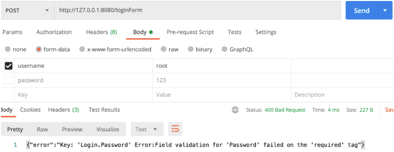

Gin框架

## Gin框架简介

```go
package main

import (
	"github.com/gin-gonic/gin"
	"io"
	"net/http"
	"os"
)

// gin框架安装: go get -u github.com/gin-gonic/gin
// Gin是一个golang的微框架，封装比较优雅，API友好，源码注释比较明确，具有快速灵活，容错方便等特点
// 对于golang而言，web框架的依赖要远比Python，Java之类的要小。自身的net/http足够简单，性能也非常不错
// 借助框架开发，不仅可以省去很多常用的封装带来的时间，也有助于团队的编码风格和形成规范

func main() {
	// 禁用控制台颜色
	gin.DisableConsoleColor()

	// 日志记录到文件
	//f, _ := os.Create("gin.log")
	f, _ := os.OpenFile("gin.log", os.O_CREATE|os.O_APPEND|os.O_WRONLY, 0644)
	gin.DefaultWriter = io.MultiWriter(f)

	// 如果需要同时将日志写入文件和控制台，请使用以下代码。
	// gin.DefaultWriter = io.MultiWriter(f, os.Stdout)

	// 1 创建路由
	r := gin.Default()

	// 2 绑定路由规则， 执行的函数
	// gin.Context 封装了 request 和 response
	r.GET("/", func(c *gin.Context) {
		c.String(http.StatusOK, "hello world!")
	})

	// 3 监听端口，默认在8080
	r.Run(":8080")
}
```

日志文件

```go
[GIN-debug] [WARNING] Creating an Engine instance with the Logger and Recovery middleware already attached.

[GIN-debug] [WARNING] Running in "debug" mode. Switch to "release" mode in production.
 - using env:	export GIN_MODE=release
 - using code:	gin.SetMode(gin.ReleaseMode)

[GIN-debug] GET    /                         --> main.main.func1 (3 handlers)
[GIN-debug] Listening and serving HTTP on :8080
[GIN] 2021/03/24 - 16:10:28 | 404 |       2.294µs |       127.0.0.1 | GET      "/favicon.ico"
[GIN] 2021/03/24 - 16:10:29 | 200 |      63.106µs |       127.0.0.1 | GET      "/"
[GIN] 2021/03/24 - 16:10:29 | 404 |         615ns |       127.0.0.1 | GET      "/favicon.ico"
```


## Gin路由

### 基本路由

```go
package main

import (
	"github.com/gin-gonic/gin"
	"net/http"
)

// gin 路由

func main() {
	// 1 创建路由
	// 默认使用了2个中间件 Logger(), Recovery()
	r := gin.Default()
	// 也可以创建不带中间件的路由
	//r := gin.New()

	// 2 绑定路由规则和执行的函数
	// gin.Context，封装了request和response
	// 2.1 GET请求
	r.GET("/", func(c *gin.Context) {
		c.String(http.StatusOK, "hello world! GET!")
	})
	// 2.2. POST请求
	r.POST("/", postURL)
	// 2.3 PUT请求
	r.PUT("/", putURL)

	// 3 监听端口
	r.Run(":8080")
}

// postURL POST请求
func postURL(c *gin.Context) {
	c.String(http.StatusOK, "POST is ok!")
}

// putURL PUT请求
func putURL(c *gin.Context) {
	c.String(http.StatusOK, "PUT is ok!")
}
```


### restful风格的api

```go
package main

import (
	"fmt"
	"github.com/gin-gonic/gin"
	"net/http"
)

// Restful风格的API
// gin支持Restful风格的API
// 即Representational State Transfer的缩写。
// 直接翻译的意思是"表现层状态转化"，是一种互联网应用程序的API设计理念：URL定位资源，用HTTP描述操作
// 1.获取	/blog/getXxx	   Get     blog/Xxx
// 2.添加	/blog/addXxx       POST    blog/Xxx
// 3.修改	/blog/updateXxx    PUT     blog/Xxx
// 4.删除	/blog/delXxxx      DELETE  blog/Xxx

// API参数
// 可以通过Context的Param方法来获取API参数

func main() {
	r := gin.Default()
	r.GET("/user/:name/*action", getAPI) //API参数: 匹配单个API参数 ，*会匹配后面所有的参数
	r.Run(":8080")
}

// getAPI 获取API参数
// http://127.0.0.1:8000/user/zhangsan/run
// 结果: zhangsan is /run
// http://127.0.0.1:8080/user/zhangshan/run/game
// 结果:zhangshan is /run/game
func getAPI(c *gin.Context) {
	name := c.Param("name")
	action := c.Param("action")
	fmt.Println(name + " is " + action)
	c.String(http.StatusOK, name+" is "+action)
}
```


### 获取url参数

```go
package main

import (
	"fmt"
	"github.com/gin-gonic/gin"
	"net/http"
)

// URL参数

func main() {
	r := gin.Default()
	r.GET("/welcome", getURL) // RUL参数
	r.Run(":8080")
}

// getURL 获取URL中的参数
// http://127.0.0.1:8080/welcome?name=alnk&age=18
// 结果 name:alnk age:18
// http://127.0.0.1:8080/welcome?name=alnk&age=18&age=100
// 结果 name:alnk age:18
// http://127.0.0.1:8080/welcome?name=alnk
// 结果 name:alnk age:
// http://127.0.0.1:8080/welcome?age=18
// 结果 name:jack age:18
func getURL(c *gin.Context) {
	name := c.DefaultQuery("name", "jack") // DefaultQuery() 若参数不存在，则返回默认值
	age := c.Query("age")                  // Query()若不存在，返回空串
	fmt.Printf("name:%s age:%s\n", name, age)
	c.String(http.StatusOK, "OK!")
}
```


### 获取表单参数

```go
package main

import (
	"fmt"
	"github.com/gin-gonic/gin"
	"net/http"
)

// 获取表单参数

// 表单传输为post请求，http常见的传输格式为四种
// application/json
// application/x-www-form-urlencoded
// application/xml
// multipart/form-data

// 表单参数可以通过PostForm()方法获取
// 该方法默认解析的是x-www-form-urlencoded或from-data格式的参数

func main() {
	r := gin.Default()
	r.POST("/", postURL) // 获取表单参数
	_ = r.Run(":8080")
}

func postURL(c *gin.Context) {
	// 表单参数设置默认值
	type1 := c.DefaultPostForm("type", "alert") // DefaultPostForm()若参数不存在，则返回默认值

	// 接收其他的Key-Value
	userName := c.PostForm("username")
	passWord := c.PostForm("password")

	// 多选框
	hobbys := c.PostFormArray("hobby")

	// 返回
	c.String(http.StatusOK, fmt.Sprintf("type is %s, username is %s, password is %s, hobbys is %v",
		type1, userName, passWord, hobbys))
}

```

```html
<!DOCTYPE html>
<html lang="en">
<head>
    <meta charset="UTF-8">
    <title>登录</title>
</head>
<body>

<form action="http://127.0.0.1:8080/" method="post" enctype="application/x-www-form-urlencoded">
    用户名: <input type="text" name="username">
    <br>
    密码:<input type="password" name="password">
    <br>
    兴趣爱好:
    <input type="checkbox" value="run" name="hobby">跑步
    <input type="checkbox" value="game" name="hobby">游戏
    <input type="checkbox" value="money" name="hobby">金钱
    <br>
    <input type="submit" value="登录">
</form>

</body>
</html>
```


### 上传单个文件

```go
package main

import (
	"fmt"
	"github.com/gin-gonic/gin"
)

// gin 上传单个文件

// multipart/form-data格式用于文件上传
// gin文件上传与原生的net/http方法类似，不同在于gin把原生的request封装到c.Request中

func main() {
	r := gin.Default()
	r.POST("/upload", upload)
	_ = r.Run(":8080")
}

// upload 上传单个文件
func upload(c *gin.Context) {
	// 表单取文件
	file, _ := c.FormFile("file")
	fmt.Println(file.Filename)

	// 传到项目的根目录，名字就用本身的
	// 建议统一转换名字，为了安全起见
	_ = c.SaveUploadedFile(file, file.Filename)

	// 返回给客户端
	c.String(200, fmt.Sprintf("%s upload!", file.Filename))
}
```

  


### 上传多个文件

```go
package main

import (
	"fmt"
	"github.com/gin-gonic/gin"
	"net/http"
)

// gin 上传多个文件

func main() {
	r := gin.Default()
	// 限制表单上传大小 8MB，默认为32MB
	r.MaxMultipartMemory = 8 << 20
	r.POST("/upload", upload)
	_ = r.Run(":8080")
}

// upload 上传多个文件
func upload(c *gin.Context) {
	form, err := c.MultipartForm()
	if err != nil {
		c.String(http.StatusBadRequest, fmt.Sprintf("get err %s", err.Error()))
		return
	}

	// 获取所有图片
	files := form.File["file"]
	fmt.Println("files", files)
	// 遍历所有图片
	for _, file := range files {
		// 逐个保存
		err := c.SaveUploadedFile(file, file.Filename)
		if err != nil {
			c.String(http.StatusBadRequest, fmt.Sprintf("save pic failed, %s", err.Error()))
			return
		}
	}

	c.String(200, fmt.Sprintf("upload ok %d file", len(files)))
}
```


### 路由组

```go
package main

import "github.com/gin-gonic/gin"

// routes group 是为了管理一些相同的URL

func main() {
	// 1 创建路由
	r := gin.Default()

	// 2 路由组，处理GET请求的路由组
	v1 := r.Group("/v1")
	// {} 是gin框架的书写规范
	{
		v1.GET("/index", index)
		v1.GET("/login", login)
	}

	// 3 监听
	r.Run(":8080")
}

func index(c *gin.Context) {
	c.String(200, "index is ok!")
}

func login(c *gin.Context) {
	c.String(200, "login is ok!")
}
```


## Gin数据解析和绑定

### json数据解析和绑定

```go
package main

import (
	"github.com/gin-gonic/gin"
	"net/http"
)

// json数据解析和绑定
// 把客户端传递过来的json数据绑定到结构体

// 定义接收的结构体
type Login struct {
	// binding:"requeired" 修饰的字段，如果接收为空值，则报错，是必须字段
	User     string `binding:"required"`
	Password string `binding:"required"`
}

func main() {
	// 创建路由
	r := gin.Default()

	// json 绑定
	r.POST("/loginJson", loginJson)

	// 监听
	r.Run(":8080")
}

func loginJson(c *gin.Context) {
	// 声明接收客户端传过来的json数据的变量
	var jsonData Login

	// 将request的body中的数据，自动按照 json 格式解析到结构体
	err := c.ShouldBindJSON(&jsonData)
	if err != nil {
		// 如果不能解析，返回错误给客户端
		c.JSON(http.StatusBadRequest, gin.H{
			"error": err.Error(),
		})
		return
	}

	// 判断账号密码是否正确
	if jsonData.User != "root" || jsonData.Password != "123" {
		c.JSON(http.StatusBadRequest, gin.H{
			"error": "账号或者密码错误",
		})
		return
	}

	// 密码正确
	c.JSON(200, gin.H{
		"status": "200",
		"msg":    "登录成功",
	})
	return
}
```

  


  


### 表单数据解析和绑定

```go
package main

import (
	"github.com/gin-gonic/gin"
	"net/http"
)

// 表单数据解析和绑定

// 定义接收的结构体
type Login struct {
	// binding:"requeired" 修饰的字段，如果接收为空值，则报错，是必须字段
	User     string `form:"username" binding:"required"`
	Password string `form:"password" binding:"required"`
}

func main() {
	// 创建路由
	r := gin.Default()

	// 绑定路由
	r.POST("/loginForm", loginForm)

	// 监听
	r.Run(":8080")

}

func loginForm(c *gin.Context) {
	// 声明接收的变量
	var formData Login

	// Bind() 解析并且绑定 form 格式
	// 是根据请求头中的 content-type 自动推断的
	err := c.ShouldBind(&formData)
	//err := c.Bind(&formData)
	if err != nil {
		// 这是返回json数据给客户端
		c.JSON(400, gin.H{
			"error": err.Error(),
		})
		return
	}

	// 判断账号密码是否正确
	if formData.User != "root" || formData.Password != "123" {
		c.JSON(http.StatusBadRequest, gin.H{
			"error": "账号或者密码错误",
		})
		return
	}

	// 密码正确
	c.JSON(200, gin.H{
		"status": "200",
		"msg":    "登录成功Form",
	})
	return
}
```

  


  


### uri数据解析和绑定

```go
package main

import (
	"github.com/gin-gonic/gin"
	"net/http"
)

// uri数据解析和绑定

// 定义接收的结构体
type Login struct {
	// binding:"requeired" 修饰的字段，如果接收为空值，则报错，是必须字段
	User     string `uri:"user" binding:"required"`
	Password string `uri:"password" binding:"required"`
}

func main() {
	// 创建路由
	r := gin.Default()

	// 绑定路由
	r.GET("/:user/:password", loginUrl)

	// 监听
	r.Run(":8080")
}

func loginUrl(c *gin.Context) {
	// 声明接收的变量
	var loginUri Login

	// 解析数据
	err := c.ShouldBindUri(&loginUri)
	if err != nil {
		c.JSON(http.StatusBadRequest, gin.H{
			"error": err.Error(),
		})
		return
	}

	// 判断账号密码是否正确
	if loginUri.User != "root" || loginUri.Password != "123" {
		c.JSON(http.StatusBadRequest, gin.H{
			"error": "账号或者密码错误",
		})
		return
	}

	// 密码正确
	c.JSON(200, gin.H{
		"status": "200",
		"msg":    "登录成功",
	})

	return
}
```

  


### URL数据解析和绑定

```go
package main

import (
	"github.com/gin-gonic/gin"
	"net/http"
)

// GET URL 数据解析和绑定

// 定义接收的结构体
type Login struct {
	// binding:"requeired" 修饰的字段，如果接收为空值，则报错，是必须字段
	User     string `form:"user" binding:"required"`
	Password string `form:"password" binding:"required"`
}

func main() {
	// 创建路由
	r := gin.Default()

	// 绑定路由
	r.GET("/loginUrl", loginUrl)

	// 监听
	r.Run(":8080")

}

func loginUrl(c *gin.Context) {
	// 声明接收的变量
	var loginData Login

	// 解析数据
	err := c.ShouldBindQuery(&loginData)
	if err != nil {
		// 如果不能解析，返回错误给客户端
		c.JSON(http.StatusBadRequest, gin.H{
			"error": err.Error(),
		})
		return
	}

	// 判断账号密码是否正确
	if loginData.User != "root" || loginData.Password != "123" {
		c.JSON(http.StatusBadRequest, gin.H{
			"error": "账号或者密码错误",
		})
		return
	}

	// 密码正确
	c.JSON(200, gin.H{
		"status": "200",
		"msg":    "登录成功",
	})
	return
}
```

  


 


## Gin渲染

### 各种数据响应格式

```go
package main

import (
	"github.com/gin-gonic/gin"
	"github.com/gin-gonic/gin/testdata/protoexample"
)

// 各种数据格式的响应到客户端

func main() {
	// 1 创建路由
	r := gin.Default()

	// 2.1 json格式的响应 最常用
	r.GET("/someJSON", func(c *gin.Context) {
		c.JSON(200, gin.H{
			"message": "json格式的响应",
			"status":  200,
		})
	})

	// 2.2 结构体格式响应
	r.GET("/someStruct", func(c *gin.Context) {
		var msg struct {
			Name    string
			Message string
			Number  int
		}
		msg.Name = "root"
		msg.Message = "结构体格式响应"
		msg.Number = 123

		c.JSON(200, msg)
	})

	// 2.3 XML
	r.GET("/someXML", func(c *gin.Context) {
		c.XML(200, gin.H{
			"message": "abc",
		})
	})

	// 2.4 YAML
	r.GET("/someYAML", func(c *gin.Context) {
		c.YAML(200, gin.H{
			"name": "zhangshan",
		})
	})

	// 2.5 protobuf 谷歌开发的高效存储读取的工具
	r.GET("/someProtoBuf", func(c *gin.Context) {
		reps := []int64{int64(1), int64(2)}
		// 定义数据
		label := "label"
		// 传protobuf格式数据
		data := &protoexample.Test{
			Label: &label,
			Reps:  reps,
		}
		c.ProtoBuf(200, data)
	})

	// 3 监听
	r.Run(":8080")
}
```


### html模板渲染

```go
package main

import "github.com/gin-gonic/gin"

// HTML 模板渲染

// gin支持加载HTML模板, 然后根据模板参数进行配置并返回相应的数据，本质上就是字符串替换
// LoadHTMLGlob()方法可以加载模板文件

func main() {
	// 1 创建路由
	r := gin.Default()

	// 2 加载模板
	r.LoadHTMLGlob("./templates/*")

	// 3 绑定路由
	r.GET("/index", func(c *gin.Context) {
		// 根据文件名渲染
		// 最终json将title替换
		c.HTML(200, "index.tmpl", gin.H{
			"title": "我是一个很大的标题",
		})
	})

	// 4 启动程序监听端口
	r.Run(":8080")
}
```

Index.tmpl

```html
<html>
    <h1>
        {{ .title }}
    </h1>

</html>
```


### 重定向

```go
package main

import (
	"github.com/gin-gonic/gin"
	"net/http"
)

// 重定向

func main() {
	// 1 创建路由
	r := gin.Default()

	// 2 绑定路由
	// 2.1 外部重定向
	r.GET("/redirect1", func(c *gin.Context) {
		c.Redirect(http.StatusMovedPermanently, "http://www.baidu.com")
	})

	// 2.2 内部重定向
	r.GET("/redirect2", func(c *gin.Context) {
		c.Request.URL.Path = "/redirect1"
		r.HandleContext(c)
	})

	// 3 启动
	r.Run(":8080")
}
```


### 同步异步

```go
package main

import (
	"github.com/gin-gonic/gin"
	"log"
	"time"
)

// 同步异步
// goroutine 机制可以方便的实现异步处理
// 另外，在启动新的 goroutine 时，不应该使用原始上下文，必须使用它的只读副本

func main() {
	// 1 创建路由
	r := gin.Default()

	// 异步
	r.GET("/long_async", func(c *gin.Context) {
		// 需要一个副本
		copyContext := c.Copy()

		// 在启动新的 goroutine 时，不应该使用原始上下文，必须使用它的只读副本
		go func() {
			time.Sleep(5 * time.Second)
			log.Println("异步执行:" + copyContext.Request.URL.Path)
		}()

		c.String(200, "异步执行") // 直接返回数据给客户端，不需要等待5秒
	})

	// 同步
	r.GET("/long_sync", func(c *gin.Context) {
		time.Sleep(5 * time.Second)
		log.Println("同步执行:" + c.Request.URL.Path)
		c.String(200, "同步执行") // 返回数据给客户端，需要等待5秒钟，客户端才能拿到数据
	})

	// 启动程序
	r.Run(":8080")
}
```


## Gin中间件

### 全局中间件

```go
package main

import (
	"fmt"
	"github.com/gin-gonic/gin"
	"time"
)

// 全局中间件

// gin 可以构建中间件，但他只对注册过的路由函数起作用
// 对于分组路由，嵌套使用中间件，可以限定中间件的作用范围
// 中间件分为全局中间件，单个路由中间件和群组中间件
// gin 的中间件必须是一个 gin.HandlerFunc 类型

// 定义一个中间件
func MiddleWare() gin.HandlerFunc {
	return func(c *gin.Context) {
		// 计算函数执行了多长时间
		t := time.Now()
		fmt.Println("中间件开始执行了...")

		// 设置变量到Context的key中，然后调用中间件的函数可以通过Get()获取
		c.Set("request", "我是中间件")

		// c.Next() 是执行调用中间件的函数
		c.Next()

		// 调用中间件的函数执行完毕后的一些其他事项
		status := c.Writer.Status()
		fmt.Println("中间件执行完毕了...", status)

		//
		t2 := time.Since(t)
		fmt.Println("函数执行了多久: ", t2)
	}
}

func main() {
	// 1 创建路由
	r := gin.Default()

	// 2 注册中间件
	r.Use(MiddleWare())
	{
		// 3 绑定路由
		r.GET("/middleware", func(c *gin.Context) {
			// 取中间件里面的值
			req, _ := c.Get("request")
			fmt.Println("中间件中设置的值是: ", req)

			// 返回给客户端的值
			c.JSON(200, gin.H{"request": req})
		})
	}

	// 4 启动
	_ = r.Run(":8080")
}
```


### 局部中间件

```go
package main

import (
	"fmt"
	"github.com/gin-gonic/gin"
)

// 局部中间件
// 根路由后面定义的中间件

func MiddleWare() gin.HandlerFunc {
	return func(c *gin.Context) {
		fmt.Println("我是中间件...")
		c.Next()
		fmt.Println("中间件执行完毕...")
	}
}

func main() {
	r := gin.Default()

	// 局部中间件
	r.GET("/middleware", MiddleWare(), func(c *gin.Context) {
		fmt.Println("我是根路由中的函数")

		// 返回给前端的数据
		c.JSON(200, gin.H{"msg": "中间件"})
	})

	r.Run(":8080")
}
```


### 中间件练习

```go
package main

import (
	"fmt"
	"github.com/gin-gonic/gin"
	"time"
)

// 中间件练习
// 需求 定义程序计时中间件，然后定义2个路由，执行函数后应该打印统计的执行时间

// 定义中间件
func myTime() gin.HandlerFunc {
	return func(c *gin.Context) {
		t := time.Now()
		c.Next()
		// 统计时间
		fmt.Println("程序耗时:", time.Since(t))
	}
}

func main() {
	// 创建路由
	r := gin.Default()

	// 注册中间件
	r.Use(myTime())

	// 绑定路由
	shoppingGroup := r.Group("/shopping")
	{
		shoppingGroup.GET("/index", shopIndexHandler)
		shoppingGroup.GET("/home", shopHomeHandler)
	}

	// 启动程序
	r.Run(":8080")
}

func shopIndexHandler(c *gin.Context) {
	time.Sleep(5 * time.Second)
}

func shopHomeHandler(c *gin.Context) {
	time.Sleep(3 * time.Second)
}
```


## 会话控制cookie

### 简介

```go
package main

import (
	"fmt"
	"github.com/gin-gonic/gin"
)

// Cookie是什么
// HTTP是无状态协议，服务器不能记录浏览器的访问状态，也就是说服务器不能区分两次请求是否由同一个客户端发出
// cookie就是解决HTTP协议无状态的方案之一，中文是小甜饼的意思
// Cookie实际上就是服务器保存在浏览器上的一段信息。
// 浏览器有了Cookie之后，每次向服务器发送请求时都会同时将该信息发送给服务器，服务器收到请求后，就可以根据该信息处理请求
// Cookie由服务器创建，并发送给浏览器，最终由浏览器保存

// Cookie的用途
// 保持用户登录状态
// 京东购物车

// Cookie的缺点
// 不安全，明文
// 增加带宽消耗
// 可以被禁用
// cookie有上限

// 测试服务端发送cookie给客户端，客户端请求时携带cookie

func main() {
	// 创建路由
	r := gin.Default()

	// 绑定路由
	// 服务端给客户端cookie
	r.GET("/cookie", func(c *gin.Context) {
		// 获取客户端是否携带cookie
		cookie, err := c.Cookie("key_cookie")
		if err != nil {
			cookie = "NotSet"
			// 如果客户端没有携带cookie，那么就给客户端设置cookie
			// maxAge int 单位为秒 cookie存活时间
			// path cookie所在的目录
			// domain string 域名
			// secure 是否只能通过https访问
			// httpOnly bool 是否允许别人通过js获取自己的cookie
			c.SetCookie("key_cookie", "value_cookie", 60, "/", "127.0.0.1", false, true)
		}

		// 打印获取到的cookie的值
		fmt.Println("cookie的值是:", cookie)
	})

	// 启动程序
	r.Run(":8080")
}
```


第一次没有cookie

  


第二次有cookie

  


### cookie练习

```go
package main

import (
	"github.com/gin-gonic/gin"
	"net/http"
)

// Cookie练习
// 模拟实现权限验证中间件
// 有2个路由，login和home
// login用于设置cookie
// home是访问查看信息的请求
// 在请求home之前，先跑中间件代码，检验是否存在cookie

// 权限检验中间件
func AuthMiddleWare() gin.HandlerFunc {
	return func(c *gin.Context) {
		cookieValue, err := c.Cookie("key_cookie")
		// 有cookie的情况
		if err == nil {
			// 检验cookie的键
			if cookieValue == "123" {
				c.Next()
				return
			}
		}
		// 返回错误
		c.JSON(http.StatusUnauthorized, gin.H{"error": "权限校验未通过"})
		// 如果校验未通过，不再同调后续的函数
		c.Abort()
		return
	}
}

func main() {
	// 创建路由
	r := gin.Default()

	// 绑定路由
	r.GET("/login", func(c *gin.Context) {
		// 设置cookie
		c.SetCookie("key_cookie", "123", 180, "/", "127.0.0.1", false, true)
		// 返回信息
		c.String(200, "cookie设置成功")
	})

	// 访问home之前，先调用中间件中权限验证
	r.GET("/home", AuthMiddleWare(), func(c *gin.Context) {
		c.JSON(200, gin.H{"msg": "我是一个很漂亮的主页"})
	})

	r.Run(":8080")
}
```


## session中间件

```go
Session可以弥补Cookie的不足
Session必须依赖于Cookie才能使用，生成一个SessionId放在Cookie里传给客户端就可以
```


### 基于cookie的存储引擎

```go
package main

import (
	// 导入gin框架包
	"github.com/gin-gonic/gin"

	// 导入session存储引擎 cookie
	"github.com/gin-contrib/sessions/cookie"

	// 导入session包
	"github.com/gin-contrib/sessions"
)

func main() {
	r := gin.Default()

	// 创建基于cookie的存储引擎，secret11111 参数是用于加密的密钥
	store := cookie.NewStore([]byte("secret11111"))

	// 设置session中间件，参数mysession，指的是session的名字，也是cookie的名字
	// store是前面创建的存储引擎，我们可以替换成其他存储引擎
	r.Use(sessions.Sessions("mysession", store))

	r.GET("/hello", func(c *gin.Context) {
		// 初始化session对象
		session := sessions.Default(c)

		// 通过session.Get读取session值
		// session是键值对格式数据，因此需要通过key查询数据
		if session.Get("hello") != "world" {
			// 设置session数据
			session.Set("hello", "world")
			// 删除session数据
			session.Delete("Alnk")
			// 保存session数据
			session.Save()
			// 删除整个session
			// session.Clear()
		}

		c.JSON(200, gin.H{"hello": session.Get("hello")})
	})

	r.Run(":8080")
}
```


### 基于redis存储引擎

```go
package main

import (
	"fmt"
	"github.com/gin-contrib/sessions"
	"github.com/gin-contrib/sessions/redis"
	"github.com/gin-gonic/gin"
)

// redis存储引擎

func main() {
	r := gin.Default()
	// 初始化基于redis的存储引擎
	// 参数说明：
	//    第1个参数 - redis最大的空闲连接数
	//    第2个参数 - 数通信协议tcp或者udp
	//    第3个参数 - redis地址, 格式，host:port
	//    第4个参数 - redis密码
	//    第5个参数 - session加密密钥
	store, err := redis.NewStore(10, "tcp", "192.168.3.12:6379", "", []byte("secret"))
	if err != nil {
		fmt.Printf("连接redis失败, err: %v\n", err)
		return
	}

	r.Use(sessions.Sessions("mysession", store))

	r.GET("/incr", func(c *gin.Context) {
		session := sessions.Default(c)

		tag := session.Get("Login")
		if tag != nil {
			fmt.Println("-x-:", tag)
		} else {
			fmt.Println("第一次请求没有tag")
		}

		var count int
		v := session.Get("count")
		if v == nil {
			count = 0
		} else {
			count = v.(int)
			count++
		}

		session.Set("Login", "true")
		session.Set("count", count)
		_ = session.Save()

		c.JSON(200, gin.H{"count": count})
	})

	_ = r.Run(":8000")
}
```


## Gin数据库(建议使用gorm框架)

### 查询

```go
package main

import (
	"fmt"
	_ "github.com/go-sql-driver/mysql"
	"github.com/jmoiron/sqlx"
)

// 创建基础数据
// CREATE TABLE `user` (
//  `id` int(50) NOT NULL AUTO_INCREMENT,
//  `username` varchar(50) DEFAULT NULL,
//  `password` varchar(50) DEFAULT NULL,
//  PRIMARY KEY (`id`)
//) ENGINE=InnoDB AUTO_INCREMENT=10 DEFAULT CHARSET=utf8;
//
// insert  into `user`(`id`,`username`,`password`) values (1,'zs','123'),(2,'li','456'),(3,'ww','789'),(4,'zz','135'),(5,'tt','246');

// gin框架用的数据库连接也是 sqlx
// 可以参考day10的 go使用sqlx包管理mysql数据库

// 声明一个全局的db变量
var db *sqlx.DB

// initDB 初始化连接
func initDB() (err error) {
	// 1 数据库连接信息
	// 用户名:密码@tcp(IP:端口)/数据库名称
	databaseInfo := `root:root123@tcp(10.0.0.51:3306)/go`

	// 2 连接数据库
	db, err = sqlx.Connect("mysql", databaseInfo)
	if err != nil {
		return err
	}

	// 设置数据库连接池
	db.SetMaxOpenConns(16) // 设置数据库连接池最大的连接
	db.SetMaxIdleConns(4)  // 设置最大空闲连接数

	return
}

// 查询数据
type user struct {
	ID       int // 这里字段名要大写，因为db.GEt db.Select 用了反射
	Username string
	Password string
}

// 查询单条数据
func queryRowDemo(id int) {
	sqlStr := `select id, username, password from user where id = ?`
	var u user
	err := db.Get(&u, sqlStr, id)
	if err != nil {
		fmt.Println("get failed, ", err)
		return
	}
	fmt.Printf("%#v\n", u)
	fmt.Println(u.ID, u.Username, u.Password)
}

// 查询多条数据
func queryMultiRowDemo(id int) {
	sqlStr := `select id, username, password from user where id > ?`

	var users []user
	err := db.Select(&users, sqlStr, id)
	if err != nil {
		fmt.Println(err)
		return
	}

	for _, v := range users {
		fmt.Printf("%#v\n", v)
	}
}

func main() {
	err := initDB()
	if err != nil {
		fmt.Println(err)
		return
	}
	//queryRowDemo(1)
	queryMultiRowDemo(0)
}
```


### 插入

```go
package main

import (
	"fmt"
	_ "github.com/go-sql-driver/mysql"
	"github.com/jmoiron/sqlx"
)

// 插入

// 声明一个全局的db变量
var db *sqlx.DB

// initDB 初始化连接
func initDB() (err error) {
	// 1 数据库连接信息
	// 用户名:密码@tcp(IP:端口)/数据库名称
	databaseInfo := `root:root123@tcp(10.0.0.51:3306)/go`

	// 2 连接数据库
	db, err = sqlx.Connect("mysql", databaseInfo)
	if err != nil {
		return err
	}

	// 设置数据库连接池
	db.SetMaxOpenConns(16) // 设置数据库连接池最大的连接
	db.SetMaxIdleConns(4)  // 设置最大空闲连接数

	return
}

// 插入数据
func insertRowDemo() {
	sqlStr := `insert into user(username, password) values (?, ?)`
	ret, err := db.Exec(sqlStr, "沙河娜扎", "123456")
	if err != nil {
		fmt.Println(err)
		return
	}

	id, err := ret.LastInsertId() // 新插入的数据在数据库中的ID
	if err != nil {
		fmt.Println(err)
		return
	}
	fmt.Println("id: ", id)

	theRow, err := ret.RowsAffected() //插入了多少行数据
	if err != nil {
		fmt.Printf("get rows failed, err:%v\n", err)
		return
	}
	fmt.Printf("插入了[%d]行数据\n", theRow)
}

func main() {
	err := initDB()
	if err != nil {
		fmt.Println(err)
		return
	}

	insertRowDemo()
}
```


### 删除

```go
package main

import (
	"fmt"
	_ "github.com/go-sql-driver/mysql"
	"github.com/jmoiron/sqlx"
)

// 删除

// 声明一个全局的db变量
var db *sqlx.DB

// initDB 初始化连接
func initDB() (err error) {
	// 1 数据库连接信息
	// 用户名:密码@tcp(IP:端口)/数据库名称
	databaseInfo := `root:root123@tcp(10.0.0.51:3306)/go`

	// 2 连接数据库
	db, err = sqlx.Connect("mysql", databaseInfo)
	if err != nil {
		return err
	}

	// 设置数据库连接池
	db.SetMaxOpenConns(16) // 设置数据库连接池最大的连接
	db.SetMaxIdleConns(4)  // 设置最大空闲连接数

	return
}

// 删除数据
func deleteRowDemo(id int) {
	sqlStr := `delete from user where id = ?`

	ret, err := db.Exec(sqlStr, id)
	if err != nil {
		fmt.Println(err)
		return
	}

	n, err := ret.RowsAffected() //操作影响的行数
	if err != nil {
		fmt.Printf("get rows failed, err:%v\n", err)
		return
	}

	fmt.Printf("删除了%d行数据\n", n)
}

func main() {
	err := initDB()
	if err != nil {
		fmt.Println(err)
		return
	}

	deleteRowDemo(10)
}
```


### 修改

```go
package main

import (
	"fmt"
	_ "github.com/go-sql-driver/mysql"
	"github.com/jmoiron/sqlx"
)

// 删除

// 声明一个全局的db变量
var db *sqlx.DB

// initDB 初始化连接
func initDB() (err error) {
	// 1 数据库连接信息
	// 用户名:密码@tcp(IP:端口)/数据库名称
	databaseInfo := `root:root123@tcp(10.0.0.51:3306)/go`

	// 2 连接数据库
	db, err = sqlx.Connect("mysql", databaseInfo)
	if err != nil {
		return err
	}

	// 设置数据库连接池
	db.SetMaxOpenConns(16) // 设置数据库连接池最大的连接
	db.SetMaxIdleConns(4)  // 设置最大空闲连接数

	return
}

// 修改数据
func updateRowDemo(password string, id int) {
	sqlStr := `update user set password=? where id=?`

	ret, err := db.Exec(sqlStr, password, id)
	if err != nil {
		fmt.Println(err)
		return
	}

	n, err := ret.RowsAffected() // 操作影响了多少行
	if err != nil {
		fmt.Println(err)
		return
	}

	fmt.Printf("更新数据成功，影响了 [%d] 行数据", n)
}

func main() {
	err := initDB()
	if err != nil {
		fmt.Println(err)
		return
	}

	updateRowDemo("67890", 12)
}
```